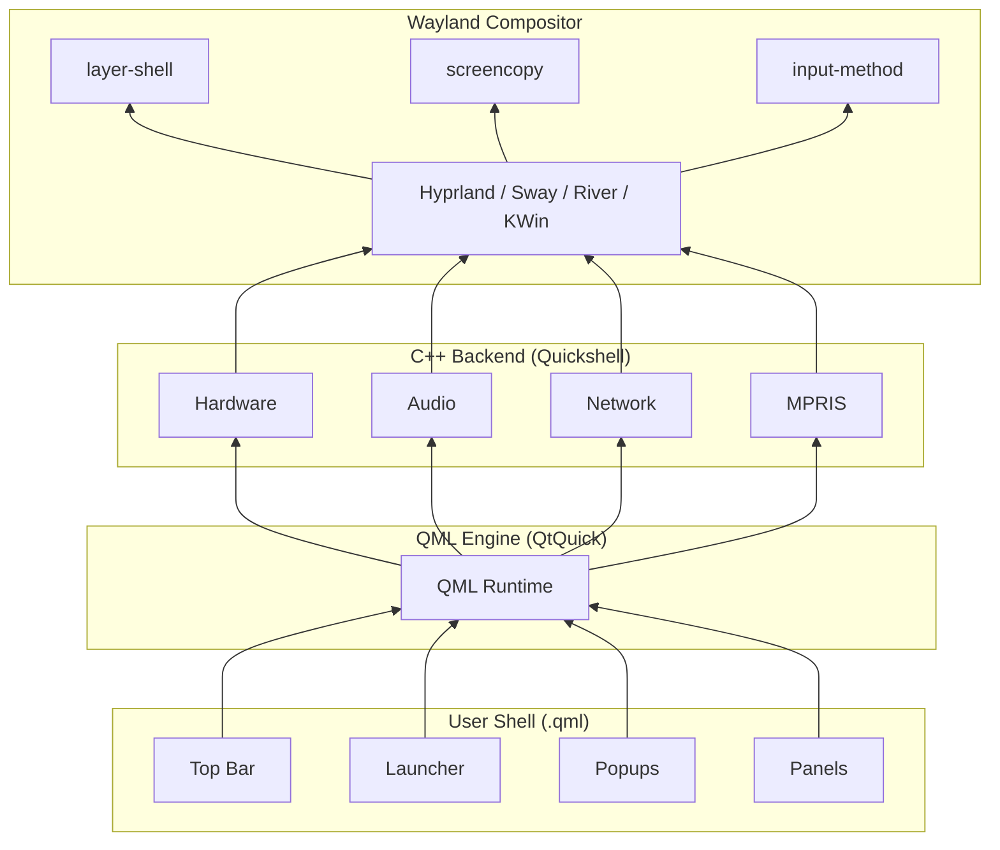
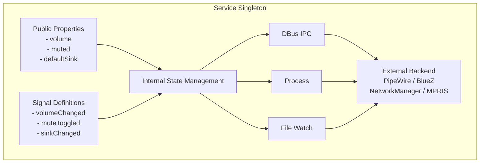
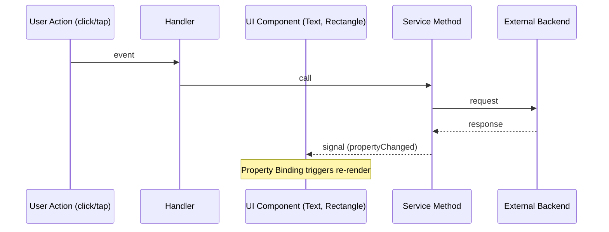
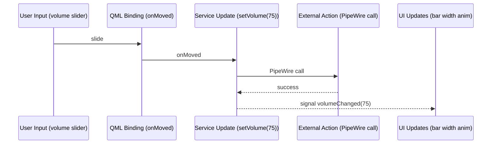
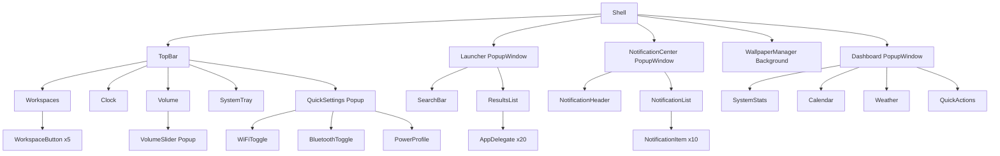

# Architecture Diagrams

This appendix provides visual diagrams of Quickshell's architecture, component relationships, and data flow patterns.

## High-Level Architecture



## Service Architecture



## Data Flow: UI Component



## State Management Flow



## Process Lifecycle

```mermaid
graph LR
    subgraph "1. Startup"
        PA[Parse Args]
        IE[Initialize QML Engine]
        LS[Load shell.qml]
        CW[Create Windows]
    end
    subgraph "2. Running"
        EL[Event Loop (Qt)]
        SC[Service Callbacks]
        TT[Timer Triggers]
    end
    subgraph "3. Shutdown"
        SA[Save State]
        DS[Disconnect Services]
        DW[Destroy Windows]
        CM[Cleanup Memory]
    end
    PA --> IE --> LS --> CW
    CW --> EL
    EL --> SC
    EL --> TT
    TT --> SA
    SC --> DS
    DS --> DW --> CM
```

## Component Hierarchy (Example Shell)



## Network Architecture (DBus)

```mermaid
graph LR
    QML[QML Code]
    QS[Quickshell Service (C++)]
    EXT[External Service Daemon<br/>pipewire, etc]

    QML -->|DBus signal| QS
    QS -->|DBus call| EXT
    EXT -->|DBus response| QS
    QS -->|propertyChanged| QML
```

## Exercises

<ExerciseBlock :difficulty="1">
Draw an architecture diagram for your specific shell. Include all services, components, and popups. Identify the data flow for each user interaction (click, keypress, timer).
</ExerciseBlock>

<ExerciseBlock :difficulty="2">
Create a sequence diagram for the "user adjusts volume" flow. Show: MouseArea click → VolumeSlider → AudioService.setVolume() → PipeWire → volumeChanged → UI update.
</ExerciseBlock>

<ExerciseBlock :difficulty="3">
Diagram your shell's startup sequence. Time each phase with console.log. Optimize the slowest phase by applying lazy loading or caching techniques from the optimization chapters.
</ExerciseBlock>

<Recap :points="['Quickshell has a 4-layer architecture: UI, QML Engine, C++ Services, Compositor', 'Services are singletons that bridge QML to external backends via DBus/process', 'Data flows bidirectionally: UI -> Service -> Backend -> signal -> UI', 'Component hierarchy starts from a single shell.qml entry point']" />

<!--
Sources verified for this chapter:
- https://quickshell.org/docs/ — Quickshell documentation
- https://en.wikipedia.org/wiki/Sequence_diagram — Sequence diagrams
-->
