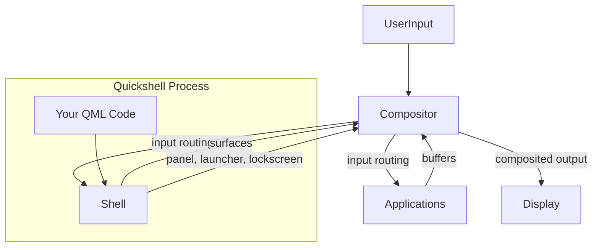

<ChapterMeta reading-time="4 min" :difficulty="1" />

## The Problem

You hear "Hyprland is a compositor," "Sway is a compositor," "i3 is a window manager." But then someone says "I run Hyprland as my compositor and Quickshell as my shell." What exactly is the compositor doing that the shell isn't?

## The Naive Approach

On X11, the window manager and the display server are separate programs. You might run Openbox as a window manager on top of the Xorg server. The window manager handles decorations, positioning, and focus; the server handles input and output.

Wayland collapses this distinction. In Wayland, the compositor *is* the display server — there's no separate server process. But there's a new distinction that replaces the old one: **compositor vs. shell**.

<MentalModel>

Imagine a theater. The compositor is the stage crew and lighting technicians: they control what's visible, where things are placed, and how the stage looks. The shell is the set design and the program: it decides that there should be a curtain (the panel), a spotlight on the lead actor (the active window), and signs pointing to exits (system tray icons). The stage crew makes it happen; the shell designs what happens.

</MentalModel>

## The Idea

A Wayland compositor does three things:

1. **Accepts buffers** from client applications (each client renders its own window into a pixel buffer)
2. **Composite those buffers** into a final image (applying transformations, blending, layers)
3. **Manages input** — routes keyboard, mouse, and touch events to the appropriate client

The compositor doesn't necessarily know or care about things like "this bar shows the clock" or "clicking the network icon opens a menu." It just knows "there's a surface at the top of the screen that's 1920×32 pixels, and clicks in this region go to that surface."

A shell (what you build with Quickshell) creates those surfaces and decides what they contain. The shell creates a panel window, fills it with a clock and system tray, pops up menus on click, and handles the logic. The compositor just renders and routes input.

## Common Compositors

| Compositor | Type | Notes |
|---|---|---|
| **Hyprland** | Tiling compositor | Dynamic tiling, animations, extensive IPC |
| **Sway** | Tiling compositor | i3-compatible, stable, well-documented |
| **River** | Tiling compositor | Minimal, dynamic layout |
| **KWin** | Full compositor | KDE's compositor, supports plugins |
| **Wayfire** | Stacking compositor | 3D effects, plugin-based |

Quickshell works with any compositor that supports the Layer Shell protocol and standard Wayland protocols. The shell you build will work on Hyprland, Sway, River, and others with no code changes.

## What Quickshell Handles

Quickshell sits between your QML code and the compositor. It:

- Creates Wayland surfaces and manages the Layer Shell protocol
- Handles output (monitor) enumeration and per-output windows
- Manages exclusive zones so panels don't overlap windows
- Integrates with compositor-specific features (Hyprland IPC, etc.)
- Provides the runtime for hot reload and dev tooling

Your QML code describes what the shell *looks like*. Quickshell handles the Wayland plumbing that makes it appear *on screen*.

<Recap :points="['The compositor manages surfaces, rendering, and input; the shell creates surfaces and defines their content', 'Wayland compositors include Hyprland, Sway, River, KWin, and Wayfire', 'Quickshell provides the Wayland plumbing — you write QML to define the shell appearance and behavior', 'Layer Shell support lets Quickshell work across compositors without code changes']" next-chapter="/part-0-fundamentals/where-quickshell-fits" />

<!--
Sources verified for this chapter:
- https://quickshell.org/about/ — overview of Quickshell's role
- https://quickshell.org/docs/guide/introduction/ — PanelWindow, FloatingWindow documentation
-->
