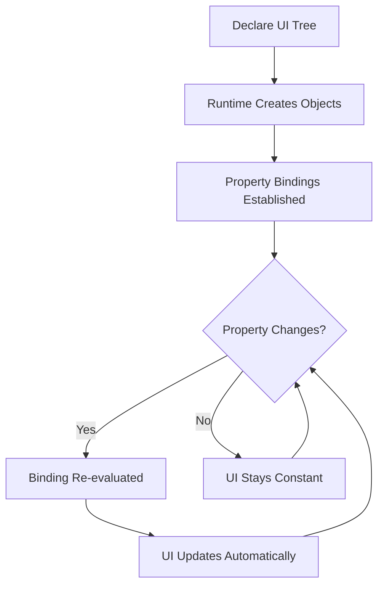

<ChapterMeta reading-time="5 min" :difficulty="1" />

## The Problem

You open a QML file and see something like this:

```qml
Rectangle {
  width: 200
  height: 100
  color: "steelblue"
  Text {
    text: "Hello"
    anchors.centerIn: parent
  }
}
```

It looks like JSON or CSS — a list of property assignments. But it's not static configuration. It's *code*. The rectangle appears on screen, the text centers itself inside it, and if you change `width` or `text` later, everything updates automatically. How does that work?

## The Naive Approach

In imperative programming, you describe *how* to do something, step by step:

```javascript
// Imperative approach
let rect = new Rectangle()
rect.width = 200
rect.height = 100
rect.color = "steelblue"

let text = new Text()
text.text = "Hello"
text.anchors.centerIn = rect
rect.addChild(text)
```

This works, but you have to manage the sequence of operations yourself. If you forget a step or do it in the wrong order, the UI breaks. And if `rect.width` changes later, you need to remember to write code that responds to that change.

<MentalModel>

Imperative code is like giving someone turn-by-turn driving directions. Declarative code is like handing them a map with the destination marked. Both get you there, but the map is easier to change — you just mark a new destination instead of recomputing the whole route.

</MentalModel>

## The Idea

**Declarative programming** means you describe *what you want*, not *how to achieve it*. In QML, you declare a tree of objects with their properties, and the Qt runtime figures out how to create, position, and update them on screen.

When you write:

```qml
Rectangle {
  width: 200
  height: 100
  color: "steelblue"
}
```

You're describing a result: "There should be a rectangle, 200 by 100 pixels, colored steel blue." The runtime handles creating the window, allocating the pixel buffer, filling it with the right color, and updating it when properties change.

## The Magic: Property Bindings

The key that makes declarative UIs work is **property bindings**. When you write:

```qml
Text {
  text: parent.width.toString()
}
```

The `text` property is no longer the static value `parent.width.toString()`. It's a *binding expression* — a mini-program that Qt re-evaluates whenever `parent.width` changes. The text updates automatically without you writing any event handlers.

This is fundamentally different from setting a property once:

```javascript
text.text = String(parent.width) // Set once, never updates
```

In QML, you *describe the relationship* between `text` and `parent.width`, and the runtime maintains it.

## Declarative Trees

QML UIs are trees of objects. Parent objects contain children, and children can reference their parents, siblings, or any named object:

```qml
Row {
  spacing: 8
  Rectangle { width: 50; height: 50; color: "red" }
  Rectangle { width: 50; height: 50; color: "green" }
  Rectangle { width: 50; height: 50; color: "blue" }
}
```

The `Row` type automatically positions its children horizontally. You declared three rectangles and a spacing; you didn't write a loop or position calculation. The runtime handles layout.

## Why This Matters for Shells

Desktop shells are *reactive by nature*. A clock updates every second. A battery widget changes when the power cord is plugged in. A workspace indicator redraws when you switch desktops. Declarative bindings mean you describe these relationships once, and the shell stays correct forever.

In imperative style, you'd write event handlers for every possible change:

```javascript
battery.onPercentageChanged(() => updateBatteryIcon())
powerSource.onPluggedChanged(() => updateBatteryIcon())
updateBatteryIcon() // Initial render
```

In declarative QML:

```qml
BatteryWidget {
  icon: battery.percentage > 20 ? "battery-good" : "battery-low"
}
```

The binding handles initial render *and* every subsequent change. You can't forget to wire up an event because there are no events to wire.



<Recap :points="['Declarative programming describes what you want, not how to achieve it', 'Property bindings are expressions that re-evaluate automatically when dependencies change', 'QML UIs are trees of objects with automatic layout and positioning', 'Declarative style is ideal for reactive desktop shells where many properties change over time']" next-chapter="/part-0-fundamentals/event-driven-ui" />

<!--
Sources verified for this chapter:
- No Quickshell-specific APIs referenced — plain QML concepts
-->
