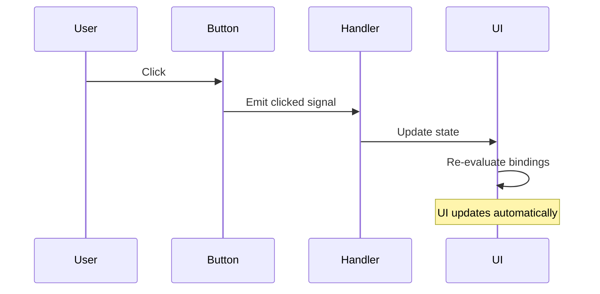

<ChapterMeta reading-time="4 min" :difficulty="1" />

## The Problem

A desktop shell does nothing on its own — it waits. Waits for the user to click a button. Waits for the clock to tick to the next minute. Waits for the battery level to drop. Waits for a notification to arrive. Everything happens *in response to something else happening first*.

This is event-driven programming: the structure of your code is dictated by the events it responds to, not by a linear sequence of operations.

## The Naive Approach

In a traditional imperative program, you might poll for changes in a loop:

```javascript
while (true) {
  if (battery.percentage != lastPercentage) {
    updateBatteryDisplay(battery.percentage)
    lastPercentage = battery.percentage
  }
  sleep(1000)
}
```

This is wasteful — you're constantly checking even when nothing changed. And it doesn't scale: checking ten different things every second means a lot of wasted CPU.

<MentalModel>

Event-driven programming is like a restaurant kitchen. The chef doesn't constantly check if an order has arrived. The printer prints a ticket, the chef sees it and acts. The timer dings, the chef removes the dish from the oven. Each event triggers a specific response. The chef's workflow is shaped by the events, not by a fixed schedule.

</MentalModel>

## The Idea

In an event-driven system, components emit **signals** when something happens, and other components respond by running **handlers**. Instead of polling, you connect sources of events to consumers of events.

QML makes this pattern central. Every object can emit signals, and every object can declare handlers for signals using the `on<SignalName>` syntax:

```qml
Button {
  text: "Click me"
  onClicked: { console.log("Button was clicked!") }
}
```

The `Button` emits `clicked` when the user presses it. The `onClicked` handler runs in response. You didn't poll, you didn't write a loop — you declared a connection.

## Declarative + Event-Driven = Reactive

QML combines declarative bindings (which handle *data* changes automatically) with signals (which handle *discrete events*). Together, they cover everything a shell needs:

| Scenario | Mechanism | Example |
|---|---|---|
| Continuous relationship | Property binding | Clock text = system time string |
| Discrete user action | Signal handler | Button click opens launcher |
| System event | Signal handler | Battery low triggers warning |
| Component lifecycle | Signal handler | Window shown/hidden |

## Signals in Quickshell

Quickshell's service types use signals to notify your shell about system events:

```qml
Hyprland.workspaceChanged.connect(function(workspace) {
  currentWorkspace = workspace.id
})
```

This connects a handler to the `workspaceChanged` signal on the `Hyprland` singleton. Whenever the user switches workspaces, the handler updates `currentWorkspace`, and any QML property bound to `currentWorkspace` updates automatically.

The same pattern applies to battery level changes, network connectivity, media playback state — every external change arrives as a signal.



<Recap :points="['Event-driven programming responds to signals rather than polling for changes', 'QML uses the on<SignalName> syntax to declare handlers inline', 'Declarative bindings handle continuous relationships; signals handle discrete events', 'Quickshell services emit Qt signals for system events like workspace changes and battery updates']" next-chapter="/part-0-fundamentals/installing-qt-and-quickshell" />

<!--
Sources verified for this chapter:
- No Quickshell-specific APIs referenced — plain QML concepts
-->
