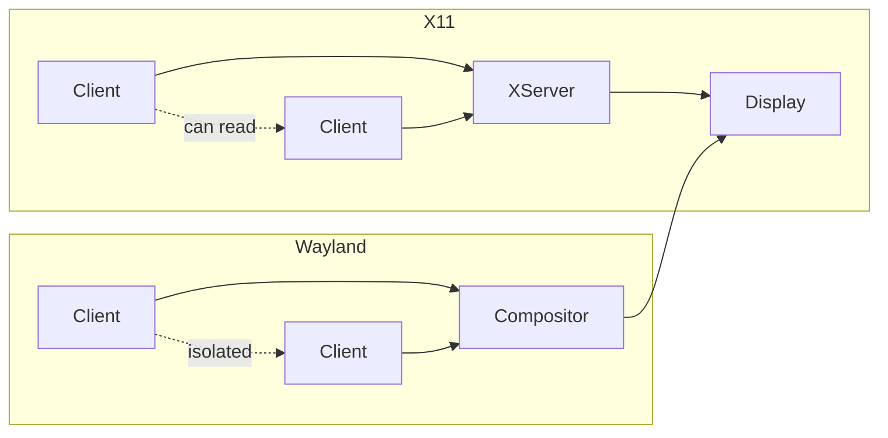

<ChapterMeta reading-time="5 min" :difficulty="1" />

## The Problem

If you've used Linux for more than a few months, you've encountered the terms "Wayland" and "X11" (or just "X"). Maybe you know that Wayland is newer and X11 is older, but the practical difference — especially for someone building a desktop shell — can be confusing.

## The Naive Approach

From a user's perspective, X11 and Wayland do the same thing: they put windows on a screen. You launch an application, a window appears, you can move it around. So why does it matter which one you use?

The difference becomes stark the moment you want to build something that doesn't behave like a normal application window — like a panel that sticks to the edge of the screen, or an overlay that appears above everything else, or a lock screen that intercepts all input.

<MentalModel>

Think of X11 as a bulletin board: anyone can pin a note anywhere, read anyone else's notes, and even rearrange the board. Wayland is more like a restaurant counter: you place your order with the server, and the server decides what to deliver and when. This makes Wayland more secure and predictable, but it also means you can't reach around the server.

</MentalModel>

## The Idea

**X11** (the X Window System, version 11) is a protocol designed in the 1980s. It uses a client-server model where the X server manages displays and input devices, and client applications connect to it to create windows. Crucially, any client can:

- Read input events from any other client
- Manipulate other clients' windows (move, resize, restack)
- Draw on the screen anywhere, including on top of other windows

This flexibility made X11 powerful for its time, but it's also why screen recording, input grabbing, and security are complicated on X11 — you need extensions like XComposite, XDamage, XRandR, and XInput2 to do things that should be straightforward.

**Wayland** is a newer protocol designed from scratch to address X11's architectural problems. In Wayland:

- The **compositor** is both the display server and the window manager
- Each client (application) has a buffer of pixels that it hands to the compositor
- The compositor decides how to composite those buffers into the final display
- Clients cannot see or affect each other's buffers
- Input events go only to the focused client

This means security is built in by design, not patched on. Screen recording requires explicit permission. A lock screen *actually* blocks input because you have to go through the compositor.

## The Layer Shell Protocol

For desktop shell builders, the most important Wayland protocol is **Layer Shell** (`wlr-layer-shell`, originally from wlroots, now widely adopted). This protocol lets a client request that its surface be placed in a specific layer:

- **Background** — behind everything (wallpaper)
- **Bottom** — above the background, below normal windows
- **Top** — above normal windows (panels, bars)
- **Overlay** — above everything (OSD, lock screen)

The compositor enforces these layers, so you get correct behavior without fighting other windows.

Quickshell wraps Layer Shell into QML types like `PanelWindow` and `FloatingWindow`, so you declare what kind of window you want and Quickshell handles the protocol negotiation.

## Why Quickshell Targets Wayland

Quickshell supports both Wayland and X11 at a low level, but its core features — Layer Shell windows, exclusive zones, per-output panels, proper transparency — are Wayland-native. On X11, these features require compositor-specific extensions or don't work at all.

If you're running a Wayland compositor (Hyprland, Sway, River, KWin, Weston), you get the full Quickshell experience. If you're on X11, Quickshell can still run, but many shell-specific features will be unavailable.

<Recap :points="['X11 is a 1980s protocol where any client can see and manipulate any other client\'s windows', 'Wayland isolates clients and puts the compositor in control of all surfaces', 'Layer Shell (wlr-layer-shell) enables panels, overlays, and lock screens through the compositor', 'Quickshell targets Wayland for its security model and Layer Shell support']" next-chapter="/part-0-fundamentals/compositors-vs-window-managers" />

<!--
Sources verified for this chapter:
- https://quickshell.org/about/ — mentions Wayland and X11 support
-->
