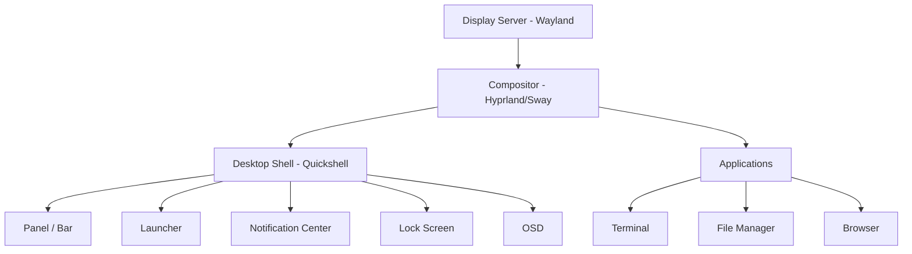

<ChapterMeta reading-time="4 min" :difficulty="1" />

## The Problem

You log into your computer. You see a desktop background, a bar at the top or bottom, icons you can click, a clock, a notification area. You press a key and a launcher appears. You click a network icon and see available Wi-Fi networks.

All of that — everything you see and interact with between logging in and launching an application — is the **desktop shell**.

## The Naive Approach

It's tempting to think of the desktop as a monolithic thing. "I use GNOME" or "I use KDE" — as if each is a single program that handles everything. In reality, a desktop shell is a collection of cooperating components:

- A **panel or bar** showing the clock, system tray, and status indicators
- An **application launcher** for finding and starting programs
- A **notification system** for alerts and messages
- A **lock screen** that secures your session
- An **OSD** (on-screen display) for volume and brightness feedback
- A **wallpaper** or background manager

Each of these is a separate UI surface that talks to the operating system and to each other.

<MentalModel>

Think of the desktop shell like the dashboard of a car. The speedometer, the fuel gauge, the infotainment screen, the climate control — each is a separate instrument, but they're arranged into a cohesive whole that the driver (you) experiences as a single environment.

</MentalModel>

## The Idea

A desktop shell is the user interface that sits between you and the operating system's window management. On Linux, this separation is especially clean thanks to Wayland's **compositor + shell** architecture: the compositor manages windows and rendering, while the shell provides the UI that the user interacts with.

Quickshell is a framework for building the shell side of that equation. It gives you the tools to create panels, windows, widgets, and system integrations without having to write a compositor from scratch.

## What a Shell Does

A desktop shell typically handles:

- **Launching applications** — presenting a menu or launcher
- **Task management** — showing running applications and letting you switch between them
- **System status** — clock, battery, network, volume
- **Notifications** — displaying and managing alerts
- **Session management** — lock screen, logout, power options
- **Input handling** — keyboard shortcuts, touch gestures
- **Workspace management** — virtual desktops or workspaces

Different shells emphasize different parts. A tiling WM shell might focus on workspace and keyboard shortcuts. A more traditional shell might emphasize a dock and desktop icons. The important thing is that *you* get to decide what matters in yours.

## Shells vs. Desktop Environments

A desktop environment (GNOME, KDE Plasma, COSMIC) bundles a shell with a suite of applications — file manager, settings app, terminal, text editor — designed to work together. A shell is a smaller concept: just the UI layer.

You can use Quickshell to build a full desktop environment's shell (bars, lockscreen, launcher) while continuing to use your favorite file manager and terminal. Or you can build just a single panel to sit alongside an existing DE. Quickshell doesn't require you to replace everything.

## What's Next

In the next chapter, we'll look at the fundamental difference between Wayland and the legacy X11 system, and why Quickshell targets Wayland exclusively.

<Recap :points="['A desktop shell is the UI layer between you and the compositor — panels, launchers, lock screens', 'A shell is not a full desktop environment; it just handles the UI surface', 'Quickshell builds the shell side, not the compositor side', 'Components of a shell include bars, launchers, notifications, OSDs, and lock screens']" next-chapter="/part-0-fundamentals/wayland-vs-x11" />

<!--
Sources verified for this chapter:
- https://quickshell.org/about/ — overview of what Quickshell does
-->
