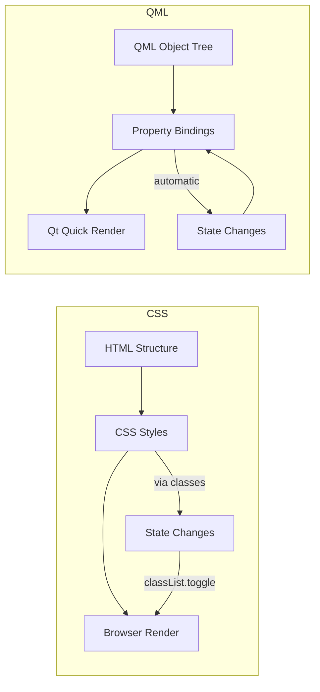

<ChapterMeta reading-time="5 min" :difficulty="1" />

## The Problem

If you've done any web development, you're used to describing a UI in HTML (the structure) and styling it with CSS (the presentation). When you first hear about QML — a declarative language for describing UIs — it sounds similar. Both use property-value pairs separated by colons:

```css
/* CSS */
.panel {
  background-color: #1a1a2e;
  color: #e0e0e0;
  padding: 8px 16px;
}
```

```qml
// QML
Rectangle {
  color: "#1a1a2e"
  height: 32
  width: parent.width
}
```

So why not just use CSS? Why learn a new language?

## The Naive Approach

A tool like Waybar lets you configure a bar using CSS classes and JSON. You pick from a set of pre-defined modules — clock, workspace, battery — and style them with CSS. This works until you want something the pre-defined modules don't support: a custom dropdown, an animated transition, a widget that combines data from two sources.

CSS was designed for styling static documents with a clear tree structure. Desktop shells are not static documents. They have state, animation, data flow, and complex interaction patterns.

<MentalModel>

CSS is like describing a photograph — colors, positions, sizes of everything in the frame. QML is like describing a puppet show — what moves, when it moves, what triggers each motion, and how the strings connect. Both describe what you see, but only one describes how it behaves.

</MentalModel>

## The Idea

QML (Qt Modeling Language) was designed from the ground up for *interactive, animated, data-driven user interfaces*. Three differences matter most:

**1. Property bindings, not static values.** In CSS, if you want an element's color to change based on state, you write two rules and toggle a class:

```css
.button { background: blue; }
.button.active { background: green; }
```

In QML, you write an expression that *stays* evaluated:

```qml
Rectangle {
  color: isActive ? "green" : "blue"
}
```

When `isActive` changes, the color updates automatically. No class toggling, no re-rendering, no selector matching.

**2. Built-in animation, not afterthought.** CSS animations were added years after CSS was invented and still have limitations. In QML, animation is a first-class concept:

```qml
Rectangle {
  Behavior on color {
    ColorAnimation { duration: 200 }
  }
}
```

This says "whenever `color` changes, animate the transition over 200ms." You don't need keyframes, easing functions aren't magic strings, and you can compose animations without JavaScript hacks.

**3. JavaScript logic, not a preprocessor.** QML embeds JavaScript directly. You can write functions, process data, and handle events in the same file as your UI description:

```qml
Item {
  function formatTime(date) {
    return date.toLocaleTimeString(Qt.locale("en_US"))
  }

  Text {
    text: formatTime(new Date())
  }
}
```

You don't need a separate scripting language or a build step for simple logic.

## What QML Doesn't Do

QML doesn't replace everything CSS does:

- **QML has no "cascade"** — no selector specificity, no inheritance. Properties apply to the object you set them on. This is more verbose but much easier to reason about.
- **QML has no pseudo-classes** — `:hover`, `:focus`, etc. Instead, you use states or property bindings with `MouseArea` and other input handlers. This is more explicit.
- **QML has no flexbox/grid in the CSS sense** — it uses `Row`, `Column`, `Grid`, and `Anchors`, which are more powerful for dynamic layouts but require learning new types.

For desktop shell development, these tradeoffs are overwhelmingly positive. Predictable layout, first-class animations, and reactive data binding are exactly what you need when building a panel that responds to system events in real time.



<Recap :points="['QML uses property bindings that update automatically, not static CSS values with class toggling', 'Animation is built into QML, not bolted on as an afterthought', 'JavaScript is embedded directly in QML for logic and data processing', 'No cascade or selector specificity — properties apply to the object they are set on']" next-chapter="/part-0-fundamentals/declarative-programming" />

<!--
Sources verified for this chapter:
- No Quickshell-specific APIs referenced — plain Qt/QML concepts
-->
