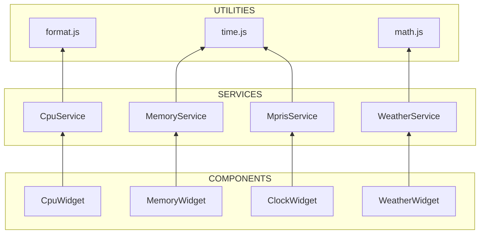

<ChapterMeta reading-time="12 min" :difficulty="1" :prerequisites="['Basic QML', 'JavaScript functions']" you-will-learn="When to use components, services, and utilities in your shell" />

## The Problem

As your shell grows from a simple bar to a full desktop environment, you'll create dozens of QML files. Without a clear architectural pattern, you'll end up with tangled imports and circular dependencies. Components will start doing data loading, services will render UI, and utilities will hold state.

## The Naive Approach

Put everything in one file:

```qml
// all-in-one.qml — everything in one massive file
PanelWindow {
  // 2000 lines of mixed UI, data fetching, and helper functions
}
```

This works for tiny shells but becomes unmanageable at scale. A single change to event handling can break layout, and you can't reuse the MPRIS display logic in both the panel tooltip and the dashboard.

<MentalModel>

Think of your shell as a restaurant. **Components** are the plates and tableware — they display food to the customer. **Services** are the kitchen appliances — they prepare and transform raw ingredients. **Utilities** are the pantry — they store ingredients in a reusable form.

</MentalModel>

## The Three Patterns

### Components (UI + Layout)

A component is a QML file that renders visual elements and handles user interaction. It imports services for data and utilities for helpers, but never directly manages state or performs side effects.

**One component equals one QML file** with a single root item.

```qml
// components/CpuWidget.qml
import Quickshell.Services.Hardware

Item {
  property double usage: CpuService.usagePercent
  Text { text: usage.toFixed(1) + "%" }
}
```

Components are:
- Visual — they render something
- Stateless — they read data from services
- Reusable — the same component appears in bar, dashboard, and tooltip
- Testable — feed mock data and verify rendering

### Services (Data + State)

A service is a singleton or shared object that manages data fetching, state, and side effects. It has no visual output of its own — it's imported by components.

Quickshell provides many built-in services (`CpuService`, `MemoryService`, `MprisService`, etc.). You can write custom services using the `Singleton` pattern.

```qml
// services/WeatherService.qml
pragma Singleton
import Quickshell

Item {
  readonly property double temperature: _temperature
  property double _temperature: 0

  Timer {
    interval: 1800000; running: true; repeat: true
    onTriggered: {
      Qt.process(["curl", "-s", "wttr.in/Paris?format=%t"])
        .onStdout.connect(function(data) { _temperature = parseFloat(data) })
    }
  }
}
```

Services are:
- Stateful — they own data
- Non-visual — they don't render anything
- Long-lived — they persist for the session
- Reactive — property changes propagate to components

### Utilities (Pure Functions)

A utility is a JavaScript module that exports pure functions and constants. It has no state and no side effects. It performs string manipulation, math, formatting, and validation.

```qml
// util/format.js
.pragma library
function bytesToHuman(bytes) {
  var units = ['B', 'KB', 'MB', 'GB', 'TB']
  var i = 0
  while (bytes > 1024 && i < units.length - 1) { bytes /= 1024; i++ }
  return bytes.toFixed(1) + ' ' + units[i]
}
```

Utilities are:
- Stateless — same input always produces same output
- Side-effect free — no network calls, no file writes
- Importable via `import "util/format.js" as Format`
- Testable with simple assertion

## How They Work Together



Data flows **up** from utilities → services → components. Components never directly call a utility when accessing data that comes from a service — they read the processed value from the service.

## When to Choose Which

| Scenario | Pattern |
|---|---|
| Rendering a progress bar for CPU | Component |
| Fetching weather from an API | Service |
| Converting bytes to human-readable | Utility |
| Storing user theme preferences | Service |
| Handling mouse click on a button | Component |
| Parsing date strings | Utility |
| Managing wallpaper slideshow timer | Service |
| Drawing a pie chart | Component |

## Common Anti-patterns

**Service rendering UI.** If your service file contains `Text`, `Rectangle`, or `opacity`, it's becoming a component. Extract the visual elements.

**Component doing data fetching.** If your component calls `Qt.process()` or reads files directly, it's becoming a service. Lift data fetching to a service.

**Utility holding state.** If your `.js` file uses `var` to store values between calls, it's not a pure utility. Move state to a service.

## Exercises

<ExerciseBlock :difficulty="1">
Audit your current shell. List every QML file and classify it as Component, Service, or Utility. Identify at least one violation and fix it.
</ExerciseBlock>

<ExerciseBlock :difficulty="2">
Build a "Currency Converter" feature using the three patterns: a `CurrencyService` that fetches exchange rates, a `formatCurrency.js` utility for number formatting, and a `ConverterWidget` component for the UI.
</ExerciseBlock>

<ExerciseBlock :difficulty="3">
Design a plugin architecture where third-party developers can contribute components without modifying your services. Define a PluginRegistry service that components register with, and a PluginBase component they extend.
</ExerciseBlock>

<Recap :points="['Components render UI, services manage data, utilities provide pure functions', 'Data flows one direction: utilities → services → components', 'Never mix concerns — a file should follow exactly one pattern', 'Quickshell built-in services (CpuService, MprisService, etc.) follow this architecture']" next-chapter="/part-10-architecture/folder-structure" />

<!--
Sources verified for this chapter:
- https://quickshell.org/docs/v0.3.0/architecture/ — Quickshell architecture overview
- https://doc.qt.io/qt-6/qtqml-documents-topic.html — QML document structure
- https://en.wikipedia.org/wiki/Singleton_pattern — Singleton design pattern
-->
