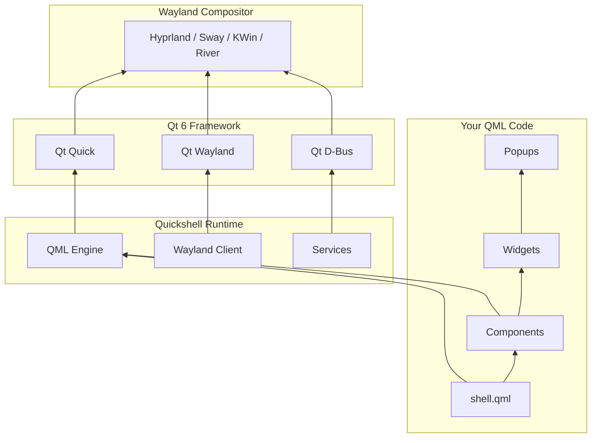

<ChapterMeta reading-time="14 min" :difficulty="4" :prerequisites="['C++ basics', 'Wayland protocols']" you-will-learn="How Quickshell is organized internally" />

## The Big Picture

Quickshell is a Qt Quick-based shell toolkit. It acts as a bridge between the Wayland compositor (via layer shell protocol) and your QML code. Understanding its architecture helps you use it more effectively and contribute to its development.

## High-Level Architecture



## Source Code Organization

The Quickshell repository on GitHub is organized as follows:

```
src/
  build/           # Build system configuration (CMake)
  launch/          # Launcher executable and CLI argument parsing
  core/            # Core types: QuickshellGlobal, ShellRoot, Variants, screens, paths
  debug/           # Linting and debugging utilities
  ipc/             # Inter-process communication command interface
  window/          # Window types: PanelInterface, PopupWindow, FloatingWindow, ProxyWindow
  io/              # I/O: process management, sockets, JSON, filesystem
  widgets/         # Reusable QML widget components (IconImage, ClippingRectangle, etc.)
  ui/              # UI components (ReloadPopup, Tooltip)
  windowmanager/   # Window manager integration
  services/        # Built-in service implementations
  wayland/         # Wayland protocol integration
  bluetooth/       # Bluetooth support
  dbus/            # D-Bus utilities (bus, properties, ObjectManager)
  network/         # Networking utilities
  x11/             # X11 support
  crash/           # Crash handling
```

Services breakdown:

```
services/
  mpris/           # Media player control via D-Bus MPRIS
  upower/          # Power device monitoring via D-Bus UPower
  notifications/   # Desktop notification server (freedesktop spec)
  status_notifier/ # System tray via StatusNotifier protocol
  pipewire/        # Audio device management via PipeWire
  polkit/          # PolicyKit authentication agent
  pam/             # PAM authentication
  greetd/          # Greetd login daemon integration
```

## Startup Sequence

1. Quickshell executable starts
2. Parses CLI arguments (`--config`, `--path`, `--debug`)
3. Creates a `QQmlEngine` instance
4. Registers all C++ types with the QML engine
5. Connects to the Wayland compositor
6. Loads your `shell.qml` file
7. QML engine evaluates the file, creating `PanelWindow` instances
8. Each `PanelWindow` creates a `wl_surface` and requests a layer-shell role
9. Compositor configures surfaces → windows become visible

## Key Design Decisions

**QML-first.** Everything is designed to be usable from QML. C++ types are registered with `QML_ELEMENT` / `QML_NAMED_ELEMENT` macros and exposed as QML elements. This means you can extend Quickshell by writing more QML — no C++ required for most use cases.

**Protocol abstraction.** Wayland protocols are wrapped in Qt-friendly C++ classes. Your QML code never touches `wl_surface` or `zwlr_layer_surface_v1` directly. These are internal implementation details.

**Service modularity.** Each built-in service is a separate QML module. You import only what you need. The modular design makes it easy to add new services.

## Dependencies

| Dependency | Purpose |
|---|---|
| Qt 6.5+ (Core, Qml, Quick, Wayland, Svg, ShaderTools) | Foundation framework |
| wayland-client (1.22+) | Wayland protocol client |
| wayland-protocols | Official Wayland protocol XML files |
| libpipewire (optional) | Audio device management |
| libdbus-1 (optional) | D-Bus integration |
| libpam (optional) | Authentication |
| libpolkit-agent-1 (optional) | PolicyKit authentication |
| libepoxy (optional) | OpenGL function pointer management |

## Exercises

<ExerciseBlock :difficulty="1">
Clone the Quickshell source code. Build it from source following the README instructions. Run `quickshell --version` to verify your build.
</ExerciseBlock>

<ExerciseBlock :difficulty="2">
Find the `PanelInterface` C++ implementation in `src/window/panelinterface.hpp`. Read through its `Anchors` value type. Trace how QML anchor properties get translated to Wayland layer-surface anchor values via `applyAnchors()` in `src/window/panelinterface.cpp`.
</ExerciseBlock>

<ExerciseBlock :difficulty="3">
Add a new built-in service. Follow the pattern of `MprisService`: create a C++ class with D-Bus signal subscription, register it with `QML_ELEMENT`, and write a minimal QML component that reads its property. Build and test.
</ExerciseBlock>

<Recap :points="['Quickshell bridges QML and Wayland via the layer-shell protocol', 'C++ types are registered as QML elements via QML_ELEMENT — no C++ needed for most use cases', 'Services are modular; import only what you need', 'Each window type (PanelInterface, PopupWindow, FloatingWindow) maps to a Wayland surface role']" next-chapter="/part-13-source-tour/core-types" />

<!--
Sources verified for this chapter:
- https://github.com/wardvis/Quickshell — Quickshell source
- https://wayland.app/protocols/wlr-layer-shell-unstable-v1 — wlr-layer-shell protocol
- https://doc.qt.io/qt-6/qtwayland-index.html — Qt Wayland
-->
