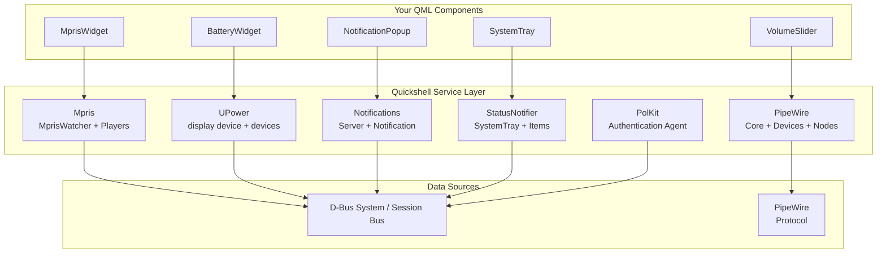

<ChapterMeta reading-time="12 min" :difficulty="3" :prerequisites="['Core types', 'C++ basics']" you-will-learn="The architecture of Quickshell's service layer" />

## The Service Layer

Quickshell provides built-in services accessible as QML imports. Each service is a C++ class registered with the QML engine. Services are singletons — one instance shared across all QML files.

## Service Architecture



## Mpris — Media Player Control

**Directory:** `src/services/mpris/`

The MPRIS service communicates with media players via D-Bus. It consists of two main classes:

- **MprisWatcher** (`watcher.hpp/cpp`) — discovers and tracks D-Bus names matching `org.mpris.MediaPlayer2.*`
- **MprisPlayer** (`player.hpp/cpp`) — represents a single player, exposes metadata and playback state

The QML entry point is `Mpris` (a `QML_SINGLETON`), which exposes an `ObjectModel<MprisPlayer>` via the `players` property.

**Registration pattern** (from `watcher.hpp`):

```cpp
class MprisQml: public QObject {
  Q_OBJECT;
  QML_NAMED_ELEMENT(Mpris);
  QML_SINGLETON;
  Q_PROPERTY(UntypedObjectModel* players READ players CONSTANT);
};

// QML usage:
// import Quickshell.Services.Mpris
// Mpris.players[0].title
```

## UPower — Power Devices

**Directory:** `src/services/upower/`

Communicates with the `org.freedesktop.UPower` D-Bus service to monitor batteries and power sources:

- **UPower** (`core.hpp/cpp`) — main singleton accessing the UPower daemon
- **UPowerDevice** (`device.hpp/cpp`) — individual battery or power supply
- **PowerProfiles** (`powerprofiles.hpp/cpp`) — power profile management

Exposes `displayDevice` (the primary battery), `devices` (all devices via `ObjectModel`), and `onBattery` (boolean power source indicator).

```cpp
class UPower: public QObject {
  Q_OBJECT;
public:
  UPowerDevice* displayDevice();
  ObjectModel<UPowerDevice>* devices();
  QBindable<bool> bindableOnBattery() const;
};
```

## Notifications — Desktop Notifications

**Directory:** `src/services/notifications/`

Implements the `org.freedesktop.Notifications` D-Bus specification:

- **NotificationServer** (`server.hpp/cpp`) — D-Bus object that receives notification requests
- **Notification** (`notification.hpp/cpp`) — data class with title, body, urgency, actions, etc.
- **DBusImage** (`dbusimage.hpp/cpp`) — image data (icon) handling from D-Bus

## StatusNotifier — System Tray

**Directory:** `src/services/status_notifier/`

Implements the KDE StatusNotifierItem protocol (system tray):

- **StatusNotifierHost** (`host.hpp/cpp`) — registers as the watcher on D-Bus
- **StatusNotifierItem** (`item.hpp/cpp`) — individual tray item with icon, menu, tooltip
- **SystemTray** QML singleton (`qml.hpp/cpp`) — exposes items as an `ObjectModel`

```cpp
// host.hpp
class StatusNotifierHost: public QObject {
  Q_OBJECT;
public:
  QList<StatusNotifierItem*> items() const;
  static StatusNotifierHost* instance();
signals:
  void itemReady(StatusNotifierItem* item);
  void itemUnregistered(StatusNotifierItem* item);
};
```

## PipeWire — Audio Devices

**Directory:** `src/services/pipewire/`

Manages audio devices and streams via the PipeWire protocol:

- **PipeWireCore** (`core.hpp/cpp`) — main connection to the PipeWire daemon
- **PWDevice** (`device.hpp/cpp`) — audio device (sink/source)
- **PWNode** (`node.hpp/cpp`) — audio node/port
- **PWLink** (`link.hpp/cpp`) — audio route/link
- **PWPeak** (`peak.hpp/cpp`) — audio peak detection

This is the most complex service, requiring direct protocol communication with PipeWire.

## PolKit — Authentication Agent

**Directory:** `src/services/polkit/`

Implements a PolicyKit authentication agent:

- **AgentImpl** (`agentimpl.hpp/cpp`) — D-Bus listener for auth requests
- **Session** (`session.hpp/cpp`) — handles individual authentication sessions
- **Identity** (`identity.hpp/cpp`) — user identity representation

## PAM and Greetd

**Directories:** `src/services/pam/`, `src/services/greetd/`

- **PAM** — provides authentication conversations via PAM modules; uses a helper subprocess for privilege separation
- **Greetd** — connects to the greetd login daemon for session management

## Adding a New Built-in Service

To add a new service to Quickshell's codebase:

1. Create `src/services/yourservice/` with your `.hpp`, `.cpp`, `qml.hpp`, `qml.cpp` files
2. Define a QObject subclass with `Q_PROPERTY` for exposed data
3. Create a QML singleton adapter (like `MprisQml`) using `QML_NAMED_ELEMENT` + `QML_SINGLETON`
4. Wire up instance access via a static `instance()` method on the service class
5. Add to `src/services/CMakeLists.txt` and implement the service plugin

**Registration pattern (modern, with QML_ELEMENT):**

```cpp
class YourServiceQml: public QObject {
  Q_OBJECT;
  QML_NAMED_ELEMENT(YourService);
  QML_SINGLETON;

public:
  // Expose data via Q_PROPERTY or Q_INVOKABLE methods
};

// QML usage:
// import Quickshell.Services.YourService
// YourService.someProperty
```

The service module must be added to the build system via CMake's `add_subdirectory()` in `src/services/CMakeLists.txt`.

## Exercises

<ExerciseBlock :difficulty="1">
Read `src/services/mpris/watcher.hpp` and `src/services/mpris/player.hpp`. Trace how `MprisQml` exposes players to QML. Add a `canGoNext` property to `MprisPlayer` that reads from `org.mpris.MediaPlayer2.Player.CanGoNext`.
</ExerciseBlock>

<ExerciseBlock :difficulty="2">
Read `src/services/upower/device.hpp` and `src/services/upower/core.hpp`. The UPower service tracks all power devices. Add a `timeToEmpty` property to `UPowerDevice` that reads from the UPower D-Bus property of the same name.
</ExerciseBlock>

<ExerciseBlock :difficulty="3">
Create a new service called `DiskService` that reads disk usage from `statfs()` via QStorageInfo. Expose `total`, `used`, `available`, and `usedPercent` for the root filesystem. Follow the pattern of the Mpris service (a singleton QML type wrapping a C++ implementation). Register it with `QML_NAMED_ELEMENT`.
</ExerciseBlock>

<Recap :points="['Services are D-Bus or PipeWire-based; most are event-driven, not polled', 'Each service has a C++ backend plus a QML singleton adapter (e.g. MprisQml)', 'ObjectModel<T> is the standard pattern for exposing lists of items to QML', 'Adding a new service requires a module directory, QML_ELEMENT registration, and CMake integration']" next-chapter="/appendix/migration-guide" />

<!--
Sources verified for this chapter:
- https://github.com/quickshell-mirror/quickshell/tree/master/src/services — Services source
- https://www.freedesktop.org/wiki/Software/status-notifier-spec/ — StatusNotifier spec
- https://pipewire.org — PipeWire
-->
