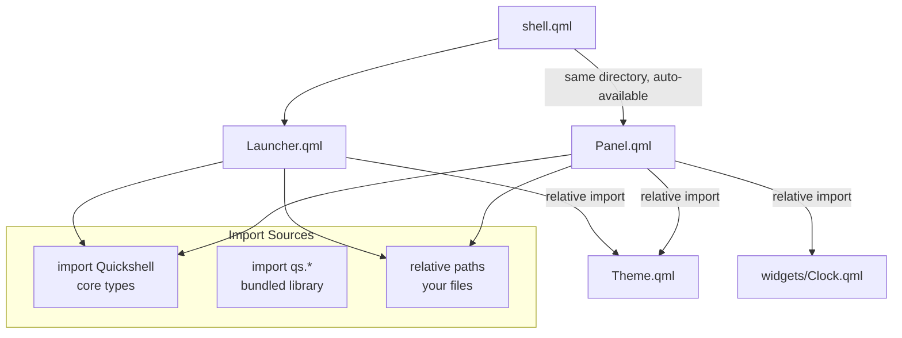

<ChapterMeta reading-time="9 min" :difficulty="2" :prerequisites="['shell.qml and ShellRoot — scope basics']" you-will-build="A modular shell with separate files for panel, launcher, and theme, connected via QML imports" />

## The Problem

Your `shell.qml` has grown past three hundred lines. The panel is in there. The launcher is in there. The wallpaper picker, the system tray, the clock widget, the workspace indicator — all in one file. Finding the section that handles volume control means scrolling past the battery monitor and the calendar popup. Every time you save, the entire file re-evaluates, even when you only fixed a typo in a label.

You need to split your shell into separate files. But QML's file and import system was designed for applications with a fixed directory structure, not for a runtime-loaded shell config that lives under `~/.config/quickshell/`.

## The Naive Approach

The instinct is to dump everything in one file until it hurts, then split by copying blocks into separate `.qml` files and hoping relative paths work.

```qml
// shell.qml — approach that does not scale
import Quickshell

ShellRoot {
  PanelWindow { /* 100 lines of panel */ }
  FloatingWindow { /* 100 lines of launcher */ }
  // ... another 200 lines of widgets
}
```

A single file like this works, but it does not separate concerns. Every edit causes the whole file to be re-parsed during hot reload. Multiple developers or even just future-you will struggle to find the right section.

## MentalModel: Each .qml file is a component

In QML, every `.qml` file defines a reusable component whose name matches the filename. `Panel.qml` defines a component called `Panel`. `Launcher.qml` defines `Launcher`. These components are available to any other QML file in the same directory — no explicit import needed for sibling files.

Quickshell extends this with its own import system. Since version 0.2, you can write `import qs.path.to.module` to pull in QML files from Quickshell's own library paths. This is separate from `import Quickshell` (which imports the core types like `ShellRoot`, `PanelWindow`, etc.) and separate from `import QtQuick` (which imports the standard Qt Quick types).

Think of your config directory as a **module tree**:

```
quickshell/
  my-config/
    shell.qml          ← entry point
    Panel.qml          ← component, auto-available to shell.qml
    Launcher.qml       ← component, auto-available
    widgets/
      Clock.qml        ← component, import as "widgets/Clock.qml"
      Weather.qml      ← component, import as "widgets/Weather.qml"
```

Files in the same directory as `shell.qml` are auto-available. Files in subdirectories are available by their relative path. This is standard QML behaviour — Quickshell does not override it.

## The Idea

Organise a Quickshell config like any non-trivial QML project:

1. **`shell.qml`** — thin root that declares scope properties and instantiates top-level windows.
2. **Component files** — one QML file per visual element (panel, launcher, widget).
3. **`lib/` or `widgets/`** — subdirectory for reusable pieces.

For imports beyond the filesystem, use Quickshell's `import qs.*` syntax:
- `import qs.path.to.module` — import QML files from Quickshell's bundled library (since 0.2)
- `import Quickshell` — import core ShellRoot, PanelWindow, FloatingWindow, etc.

The `import Quickshell` statement is the only one you must write. Everything else is optional and depends on whether you use Qt Quick types (`import QtQuick`), Qt Quick Controls (`import QtQuick.Controls`), or Quickshell submodules.

## Let's Build It

Split the shell from the previous chapter into three files.

<BuildIt>
```qml
// Theme.qml
pragma Singleton
import QtQml

QtObject {
  property color bgColor: "#1e1e2e"
  property color accent: "#89b4fa"
  property color fgColor: "#cdd6f4"
  property int panelHeight: 48
}
```
</BuildIt>

Create a panel component file:

<BuildIt>
```qml
// Panel.qml
import QtQuick
import Quickshell
import "Theme.qml" as Theme

PanelWindow {
  anchors.top: true
  anchors.left: true
  anchors.right: true
  height: Theme.panelHeight
  color: Theme.bgColor

  Text {
    text: "my panel"
    color: Theme.accent
    anchors.centerIn: parent
  }
}
```
</BuildIt>

And the root shell file:

<BuildIt>
```qml
// shell.qml
import Quickshell

ShellRoot {
  Panel { id: mainPanel }
}
```
</BuildIt>

Notice that `Panel.qml` is used as `Panel {}` in `shell.qml` without any import statement. QML engines automatically make `.qml` files in the same directory available as components. The singleton `Theme.qml` is pulled in via a relative import inside `Panel.qml`.

## Let's Improve It

For components in subdirectories, use relative import paths.

<BuildIt>
```qml
// widgets/Clock.qml
import QtQuick

Text {
  property string format: "hh:mm:ss"
  Timer {
    interval: 1000; running: true; repeat: true
    onTriggered: parent.text = Qt.formatTime(new Date(), parent.format)
  }
  color: "#cdd6f4"
}
```
</BuildIt>

Update the panel to use the clock widget:

```qml
// Panel.qml
import Quickshell
import QtQuick
import "Theme.qml" as Theme
import "widgets/Clock.qml" as ClockWidget

PanelWindow {
  anchors.top: true; anchors.left: true; anchors.right: true
  height: Theme.panelHeight
  color: Theme.bgColor

  Row {
    anchors { left: parent.left; verticalCenter: parent.verticalCenter }
    spacing: 12
    ClockWidget.Clock { format: "HH:mm" }
  }
}
```

The import path `"widgets/Clock.qml"` is relative to the file that contains the import statement (`Panel.qml`). Since `widgets/` is a subdirectory of the config directory, this resolves correctly.

For components in Quickshell's bundled library, use the `qs.*` import syntax:

```qml
import qs.widgets.bar
// Now you can use Bar { ... } if Quickshell provides it
```

This is only needed for components shipped with Quickshell itself, not for your own files.

<CommonMistake>

**Using absolute paths in imports.** `import "/home/user/.config/quickshell/my-config/Theme.qml"` works on your machine but breaks on another user's system. Always use relative paths or the `qs.*` scheme. Sibling files need no import at all — just use the component name directly.

</CommonMistake>

## Under the Hood

When Quickshell loads `shell.qml`, it creates a `QQmlEngine` and sets the base import directory to the folder containing `shell.qml`. The engine then walks the QML import paths:

1. **Same directory** — files like `Panel.qml` are auto-discovered and registered as `Panel` components.
2. **Relative imports** — paths like `"widgets/Clock.qml"` are resolved relative to the importing file's location.
3. **`import Quickshell`** — maps to the Quickshell C++ plugin which registers `ShellRoot`, `PanelWindow`, `FloatingWindow`, and other core types.
4. **`import qs.*`** — maps to Quickshell's bundled QML library, located at Quickshell's install prefix under `lib/quickshell/qml/`.

The singleton `QtObject` pattern (`pragma Singleton`) works because QML caches the singleton instance per engine. All references to `Theme.bgColor` resolve to the same object, and changes to the file are picked up by hot reload.

<UnderTheHood>
QML's `pragma Singleton` is not a Quickshell feature — it is standard Qt QML. The pragma tells the engine to create exactly one instance of the component and reuse it everywhere it is imported. Without it, each `import "Theme.qml" as Theme` would create a separate instance with separate property values.
</UnderTheHood>

<ProfessionalTip>

Put all your singleton data objects in a `data/` or `lib/` subdirectory and import them explicitly. This keeps the root directory from filling up with one-off files and makes it obvious which files are data containers versus visual components.

</ProfessionalTip>

## Diagram



## Exercises

<ExerciseBlock :difficulty="1">

Create `StatusBar.qml` that shows a `Row` of three text labels: the date, the time, and a static string "Ready". Import it from `shell.qml` as a top-level panel element.

</ExerciseBlock>

<ExerciseBlock :difficulty="2">

Move `Theme.qml` into a `data/` subdirectory. Update the import paths in `Panel.qml` and any other files so the shell still loads correctly. Confirm that hot reload works after the move.

</ExerciseBlock>

<ExerciseBlock :difficulty="3">

Create a reusable component `IconButton.qml` in a `components/` subdirectory. It should accept `iconName` (string) and `size` (int) properties and display a `Text` element using the icon font. Use `IconButton` in both the panel and the launcher. The component must be imported with a relative path in both consumers.

</ExerciseBlock>

<Recap :points="['Every .qml file defines a component available by filename in the same directory', 'Subdirectory files require a relative import path', 'import Quickshell brings in core window and scope types', 'import qs.* brings in Quickshell bundled components (since 0.2)', 'pragma Singleton ensures a single shared instance of data objects', 'The config directory root is the QML engine base path']" next-chapter="/part-2-quickshell/hot-reload" />

<!--
Sources verified:
- https://quickshell.org/ — import Quickshell, import qs.path.to.module (since 0.2)
- Standard QML behaviour: auto-available sibling files, relative imports, pragma Singleton
-->
