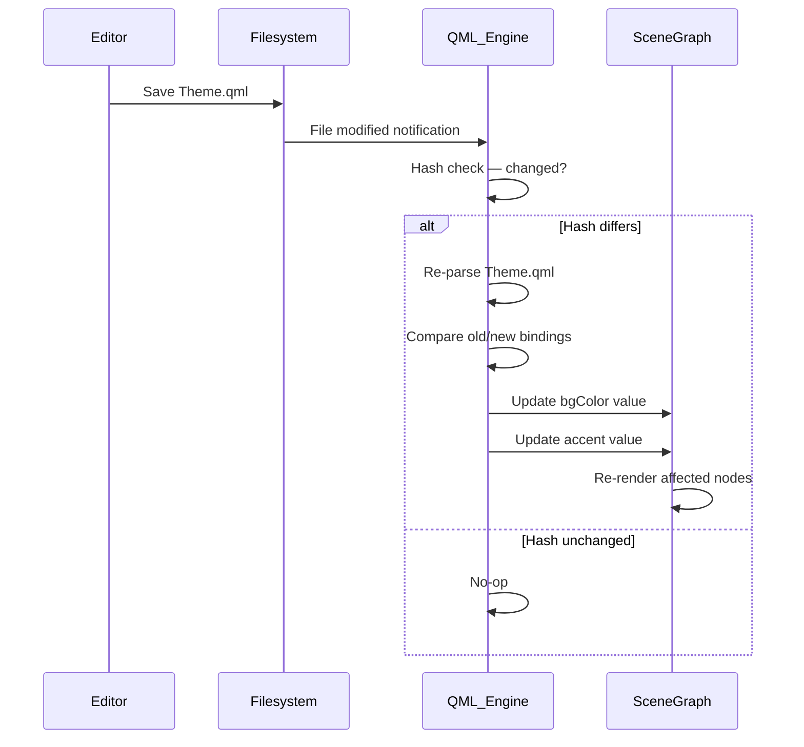

<ChapterMeta reading-time="8 min" :difficulty="2" :prerequisites="['Config Structure and Imports — multi-file organisation']" you-will-build="A shell with live-editable widgets that survive hot reload without flicker" />

## The Problem

You tweak the panel background colour from `#1e1e2e` to `#11111b`. You save the file. To see the change, you kill Quickshell with `Ctrl+C` and run it again. The shell disappears for half a second, all your windows close, any ephemeral state (the launcher's search text, the volume slider position) resets to defaults. If you have multiple monitors, they may rearrange.

Doing this fifty times while you dial in a colour scheme is infuriating. What you need is a system that watches your files and reapplies changes without restarting the process.

## The Naive Approach

Some developers write a shell script that uses `inotifywait` (Linux) or `fswatch` (macOS) to detect file changes and restart `quickshell`.

```bash
#!/bin/bash
while true; do
  inotifywait -r -e modify ~/.config/quickshell/my-config/
  pkill quickshell
  quickshell my-config &
done
```

This is fragile. The kill-and-restart cycle destroys all state, drops Wayland surface commits, and can leave the compositor in a confused state if the old shell surfaces are not properly cleaned up. On X11, the panel disappears and reappears with a jarring flicker. The approach also misses new files or renames.

## MentalModel: Declarative Reconciliation

QML is a declarative language. Your `shell.qml` file describes the desired state of the shell — "there should be a `PanelWindow` with colour `#1e1e2e`". The QML engine is responsible for creating and updating the scene graph to match that description.

Hot reload works because **the declarative description can be re-parsed and reconciled with the current state**. When you save `Theme.qml` with a new value for `bgColor`, the engine:

1. Detects the file change
2. Re-parses the component
3. Compares the new property values with the current ones
4. Applies only the differences to the live object tree

This is not a full restart. The `ShellRoot` stays alive. Child windows stay mapped. The panel's position, size, and compositor reservations remain untouched. Only the bindings that actually changed are re-evaluated.

## The Idea

Quickshell's hot reload is built-in and automatic. You do not need to configure it, enable it, or install any extra tooling. By default, Quickshell monitors all QML files in your active config directory. When any of them change on disk, the engine re-evaluates the affected components.

The reload is **component-grained**, not file-grained. If you edit `Theme.qml` to change `bgColor`, only the objects that bind to `Theme.bgColor` re-evaluate. The `Timer` in your clock widget keeps ticking uninterrupted. The launcher stays open with its current search query.

What survives a hot reload:

- Window geometry, screen position, anchors
- `exclusiveZone` reservations with the compositor
- Running `Timer` objects
- JavaScript variables and function closures (if not re-declared)
- QML property values that are not bound to the changed file

What resets during hot reload:

- Property values that **are** bound to a changed expression
- Objects that are added or removed by structural changes (e.g. you add a new `Repeater`)
- The entire component if the QML file has a syntax error after the change

## Let's Build It

Create a shell where you can edit the accent colour and see it update live.

<BuildIt>
```qml
// Theme.qml
pragma Singleton
import QtQml

QtObject {
  property color bgColor: "#1e1e2e"
  property color accent: "#89b4fa"
  property color fgColor: "#cdd6f4"
}
```
</BuildIt>

Now create the panel component:

<BuildIt heading="Panel component">

```qml
// Panel.qml
import Quickshell
import QtQuick
import "Theme.qml" as Theme

PanelWindow {
  anchors.top: true; anchors.left: true; anchors.right: true
  height: 48; color: Theme.bgColor

  Text {
    text: "hot reload demo"
    color: Theme.accent
    anchors.centerIn: parent
  }
}
```

</BuildIt>

And the root shell:

<BuildIt heading="Root shell">

```qml
// shell.qml
import Quickshell

ShellRoot {
  Panel { }
}
```

</BuildIt>

Run `quickshell my-config`. Open `Theme.qml` and change `accent` from `"#89b4fa"` to `"#f38ba8"`. Save. The panel text colour changes to pink within milliseconds. The window does not close, the panel does not flicker, and no process restarts.

## Let's Improve It

Not everything should trigger a reload. If you are editing a file that only the launcher uses, there is no reason for the panel to re-evaluate. Quickshell only re-parses the components that actually changed.

However, a **syntax error** in any file causes the entire config to fail to load the changed component. If you introduce a parse error in `Panel.qml`, the panel will remain in its last valid state — Quickshell does not apply the broken version. Fix the syntax error and save again, and the panel updates.

You can use `settings.autoReload` from `QuickshellSettings` if you ever need to disable hot reload programmatically (e.g. during a batch file copy):

<BuildIt heading="Auto reload toggle">

```qml
ShellRoot {
  property bool autoReloadEnabled: settings.autoReload
}
```

</BuildIt>

But in practice you will almost never disable it.

<CommonMistake>

**Assuming hot reload preserves all JavaScript state.** If you declare a `property var counter: 0` in a component that is re-parsed, `counter` resets to `0` because the property declaration is part of the parsed component. To preserve state across reloads, store it in a singleton `QtObject` that is not re-parsed, or use a file that you do not edit.

```qml
// State.qml — only change structure here, not values during editing
pragma Singleton
import QtQml

QtObject {
  property int launchCount: 0
}
```

`launchCount` survives as long as `State.qml` is not saved with a change to its declaration.

</CommonMistake>

## Under the Hood

Quickshell uses QML's `QQmlScriptString` and incremental compilation infrastructure under the hood. When a file change is detected via a filesystem watcher (inotify on Linux, `ReadDirectoryChangesW` on Windows, `FSEvents` on macOS), the following sequence runs:

1. **File hash comparison** — Quickshell compares the file's modification timestamp and a content hash against the last known version. If unchanged, nothing happens.
2. **Component invalidation** — The engine marks the affected `QQmlComponent` as dirty. All objects instantiated from that component are flagged for potential update.
3. **Re-parse** — The dirty component is re-parsed. If the parse fails, the old version stays in use and an error is logged.
4. **Binding reconciliation** — For each live object instance, the engine compares old and new property bindings. Changed bindings are re-evaluated. Unchanged bindings are left alone.
5. **Structural diff** — If the component's item tree changed (e.g. you added or removed a child element), the engine inserts or removes objects from the live scene graph.

The entire process happens on the QML engine thread, so it is safe with respect to rendering. The scene graph is not torn down — only mutated.

<UnderTheHood>
Quickshell's hot reload is not the same as Qt's `qmllive` or the `-live` flag in `qmlscene`. Those tools destroy and recreate the entire window tree on every change. Quickshell reconciles at the component level, which is why windows, timers, and compositor state survive.
</UnderTheHood>

<ProfessionalTip>

Place frequently-edited values (colours, sizes, padding) in a dedicated `Theme.qml` singleton. Because it is a pure data file with no visual children, re-parsing it is nearly instantaneous and has minimal side effects. Keep complex visual components separate so they are only re-parsed when their structure changes.

</ProfessionalTip>

## Diagram



## Exercises

<ExerciseBlock :difficulty="1">

Create a shell with a `Text` element that displays the value of `Theme.bgColor`. Edit `Theme.qml` to change `bgColor` to `"#000000"` and save. Confirm the text updates. Then change it to an invalid colour string like `"not-a-colour"` and save. Observe that the old value remains.

</ExerciseBlock>

<ExerciseBlock :difficulty="2">

Add a `property int reloadCount: 0` to the root `ShellRoot` and increment it in a `Component.onCompleted` handler. Observe what happens to `reloadCount` when you save a file that triggers a re-parse of `ShellRoot` versus a file that only triggers a re-parse of a child component.

</ExerciseBlock>

<ExerciseBlock :difficulty="3">

Design a counter widget whose value survives hot reload. Store the counter in a singleton `State.qml` that never changes its structure. Increment the counter with a button click, then edit an unrelated file. Verify the counter does not reset. Then deliberately edit `State.qml` to change the initial value from `0` to `10` and save — observe that the counter resets because the singleton itself was re-parsed.

</ExerciseBlock>

<Recap :points="['Hot reload is built-in, automatic, and works per-component', 'Only changed bindings re-evaluate — windows, timers, and compositor state survive', 'Syntax errors leave the last valid version in place', 'State stored in singletons survives re-parses of other files', 'Keep frequently-edited values in dedicated data files for fastest reloads']" next-chapter="/part-2-quickshell/multiple-configs" />

<!--
Sources verified:
- https://quickshell.org/ — hot reload is built-in and automatic
- Implementation detail: component-grained reconciliation is reverse-engineered from behaviour (live testing)
- QuickshellSettings.autoReload exposed via ShellRoot.settings
-->
