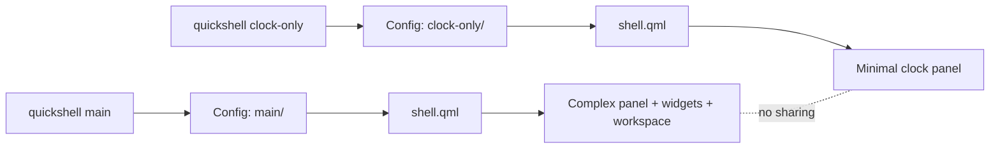

<ChapterMeta reading-time="7 min" :difficulty="2" :prerequisites="['Hot Reload', 'Config Structure & Imports']" you-will-build="A secondary config for a minimal panel with different theme and layout" />

## The Problem

You have one shell config that does everything -- workspaces, system tray, clock, launcher, wallpaper, notification center. It is complex and tailored to your main desktop. But sometimes you want to test a radically different layout, try out a new widget, or run a minimal second shell on a laptop monitor without duplicating your entire config folder.

Quickshell supports multiple named configs. Each config lives in its own subfolder under `~/.config/quickshell/` and has its own `shell.qml`. You can switch between them at any time, or even run two configs simultaneously.

## The Naive Approach

Copy the entire config folder and edit the copy:

<BuildIt heading="Naive copy approach">

```bash
cp -r ~/.config/quickshell/main ~/.config/quickshell/minimal
# Edit ~/.config/quickshell/minimal/shell.qml by hand
quickshell minimal
```

</BuildIt>

This works but duplicates everything. When you update your shared theme or add a widget to the main config, you must remember to sync the changes to the minimal config. The two folders drift apart over time.

## MentalModel: Config as Profile

A Quickshell config is just a folder with a `shell.qml` entry point. There is no build step, no manifest registration, and no central database. The folder **is** the profile. Running `quickshell <name>` tells Quickshell to load `~/.config/quickshell/<name>/shell.qml`.

You can share files between configs using QML relative imports (`import "../shared/Theme.qml" as Theme`). This lets you factor common code into a shared folder while keeping per-config differences minimal.

## The Idea

To create a second config:

1. Create a new folder under `~/.config/quickshell/`, e.g. `~/.config/quickshell/test/`
2. Write a `shell.qml` inside it
3. Run `quickshell test`

That is all. The new config runs as a separate process with its own `ShellRoot`, its own windows, and its own compositor surfaces. Configs do not share state at runtime -- each is a separate QML engine instance.

To share code between configs, place the shared QML files in a folder outside any config (e.g. `~/.config/quickshell-shared/`) and import them with relative paths:

<BuildIt heading="Shared theme approach">

```qml
// ~/.config/quickshell/test/shell.qml -- uses shared theme
import Quickshell
import "../../quickshell-shared/Theme.qml" as Theme

ShellRoot {
  PanelWindow {
    color: Theme.bgColor
    anchors.top: true; anchors.left: true; anchors.right: true
    height: 48
  }
}
```

</BuildIt>

## Let's Build It

Create a minimal config that shows just a clock -- useful for a secondary monitor or a quick test:

<BuildIt heading="Minimal clock config">

```qml
// ~/.config/quickshell/clock-only/shell.qml
import Quickshell
import QtQuick

ShellRoot {
  PanelWindow {
    anchors.top: true; anchors.left: true; anchors.right: true
    height: 36
    exclusiveZone: 36
    color: "#1e1e2e"

    Text {
      text: new Date().toLocaleTimeString(Qt.locale(), "HH:mm:ss")
      color: "#cdd6f4"
      font.pixelSize: 16
      anchors.centerIn: parent
    }
  }
}
```

</BuildIt>

Run it:

```bash
quickshell clock-only
```

You now have a second shell running alongside your primary config. The clock appears on your screen as an independent panel.

## Switching and Managing Configs

- **List configs**: `ls ~/.config/quickshell/`
- **Switch default**: `quickshell` (no argument) loads the last-used config, stored in `~/.config/quickshell/last-used`
- **Run specific**: `quickshell <name>` loads the named config regardless of the last-used setting
- **Run multiple**: `quickshell main & quickshell clock-only &` -- both run simultaneously

Because each config is a separate process, they do not interfere. If one crashes, the other continues running.

<ProfessionalTip>

Use symbolic links to keep a "current" config that you can point to without changing launch commands:

<BuildIt heading="Symlink approach">

```bash
ln -sf ~/.config/quickshell/minimal ~/.config/quickshell/current
quickshell current
```

</BuildIt>

</ProfessionalTip>

## Under the Hood

When Quickshell starts with a config name, it:

1. Resolves the config folder from `XDG_CONFIG_HOME/quickshell/<name>/` (defaulting `XDG_CONFIG_HOME` to `~/.config`)
2. Reads `settings.autoReload` and other settings from `quickshell.json` inside that folder (if present)
3. Creates a new `QQmlEngine` instance
4. Loads `shell.qml` as the root component
5. The engine instantiates `ShellRoot`, which creates child windows

Each config gets its own engine, its own `QQuickWindow` instances, and its own compositor surface tree. This is why configs are isolated -- they share no QML state.

<UnderTheHood>

The `last-used` file is written every time Quickshell starts normally (not via a specific name). It contains the absolute path of the last-loaded config so that an unadorned `quickshell` command picks up where you left off.

</UnderTheHood>

<CommonMistake>

**Assuming configs share the same `settings` object.** Each config has its own `QuickshellSettings` derived from its own `quickshell.json`. If you want a global setting, you must either read a shared file at startup or use an external mechanism (e.g., a JSON file in a known location that both configs watch).

</CommonMistake>

## Diagram



## Exercises

<ExerciseBlock :difficulty="1">

Create a second config called `debug` that opens a single `FloatingWindow` with a `Text` element displaying `"Debug Shell"`. Run it alongside your main config. Verify that both appear on screen simultaneously.

</ExerciseBlock>

<ExerciseBlock :difficulty="2">

Create a shared `Theme.qml` in `~/.config/quickshell-shared/theme/Theme.qml` that defines `bgColor` and `accent`. Import it from two different configs. Change `bgColor` in the shared file, save, and observe that both configs update via hot reload.

</ExerciseBlock>

<ExerciseBlock :difficulty="3">

Write a launch script that starts your primary config and a second "debug" config, then monitors both processes. If either exits, log the exit code and restart only that config. This is the foundation of a resilient shell setup.

</ExerciseBlock>

<Recap :points="['Each config is a subfolder under ~/.config/quickshell/ with its own shell.qml', 'Configs run as separate processes with independent QML engines', 'Share code between configs via relative QML imports from outside the config folder', 'Run multiple configs simultaneously for testing or multi-monitor setups', 'The last-used config is stored in ~/.config/quickshell/last-used']" next-chapter="/part-3-windows/panel-window" />

<!--
Sources verified for this chapter:
- https://quickshell.org/docs/guide/introduction/ — Quickshell introduction
- https://quickshell.org/docs/v0.3.0/guide/qml-language/ — QML Language Reference
- https://quickshell.org/docs/guide/install-setup — Installation & Setup
-->
