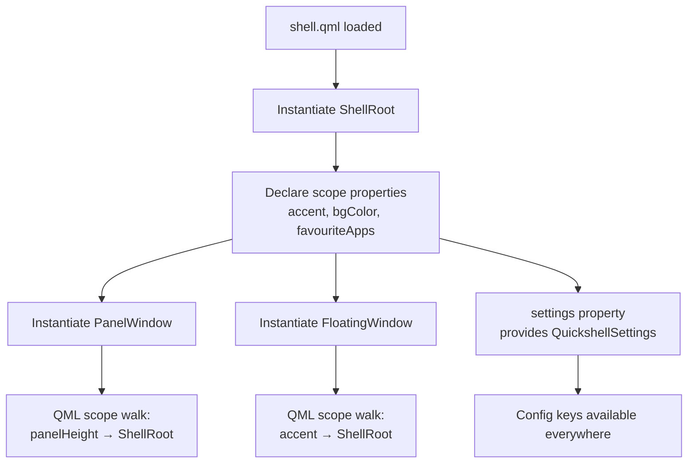

<ChapterMeta reading-time="10 min" :difficulty="2" :prerequisites="['What Quickshell Adds — PanelWindow and anchors']" you-will-build="A shell with shared theme colours, a clock panel, and a launcher window that reads from the root scope" />

## The Problem

You have built a panel and a wallpaper window in separate files. Both need to use the same accent colour, the same font size, and the same list of favourite applications. If you hard-code the colour `#89b4fa` in the panel and later want to change it, you have to find every occurrence across every file. If the launcher needs the same list of favourites, you end up duplicating the array in two places — and they will inevitably drift out of sync.

What you want is a **single source of truth** for your shell that every window can read from.

## The Naive Approach

Newcomers often store shared state in a global JavaScript object or use QML's `property` declarations on each window with manual signal wiring to keep them in sync.

<BuildIt heading="The naive approach">

```qml
// Panel file
Item {
  property string accentColor: "#89b4fa"
  property var favourites: ["firefox", "kitty", "code"]
}

// Launcher file — duplicated!
Item {
  property string accentColor: "#89b4fa"
  property var favourites: ["firefox", "kitty", "code"]
}
```

This breaks immediately. If the panel updates `favourites`, the launcher never finds out. If you change `accentColor` in one place, you have to remember to change it in the other. You are maintaining two copies of every piece of state.

</BuildIt>

## MentalModel: Scope as Dependency Injection

`ShellRoot` is a `Scope`. In Quickshell, a `Scope` is a QML `Item` whose properties are visible to all its descendants — not through bindings or IDs, but through the QML scope chain itself.

If you write this:

<BuildIt heading="Scope resolution example">

```qml
ShellRoot {
  property string accent: "#89b4fa"

  PanelWindow { /* ... */ }
  FloatingWindow {
    Text { text: accent }  // works — resolves through scope
  }
}
```

The `Text` inside `FloatingWindow` can reference `accent` directly because QML walks up the scope chain and finds it on `ShellRoot`. You do not need IDs, import paths, or signal handlers.

</BuildIt>

Think of `ShellRoot` as a **dependency injection container** for your shell. Anything every window needs — colours, font settings, application lists, backend connections — lives here. Children consume it by name, and QML's reactivity ensures that if `accent` changes, every binding that references it re-evaluates.

## The Idea

`shell.qml` is not just the file Quickshell loads — it is the **root component** that defines your shell's identity. Properties declared on `ShellRoot` are accessible from anywhere in the tree. Because `ShellRoot` is also a singleton for the lifetime of the process, it is the natural home for:

- **Theme values** — colour palette, font family, spacing
- **Runtime state** — current workspace, brightness level, which virtual desktop is active
- **Configuration data** — lists of pinned apps, widget preferences
- **Global services** — a weather API wrapper, a battery monitor, a wallpaper backend

The `settings` property (a `QuickshellSettings` object, read-only) is inherited from `ShellRoot` and gives you access to Quickshell's own configuration keys, but everything else is yours to define.

## Let's Build It

Here is a shell with a theme declared on `ShellRoot` and consumed by two windows.

<BuildIt>
```qml
import Quickshell

ShellRoot {
  // —— Single source of truth for the entire shell ——
  property color bgColor: "#1e1e2e"
  property color accent: "#89b4fa"
  property color fgColor: "#cdd6f4"
  property int panelHeight: 48
  property var favouriteApps: ["firefox", "kitty", "code-oss"]

  // —— Panel ——
  PanelWindow {
    anchors.top: true
    anchors.left: true
    anchors.right: true
    height: panelHeight  // reads from ShellRoot
    color: bgColor       // reads from ShellRoot

    Row {
      anchors.left: parent.left
      anchors.verticalCenter: parent.verticalCenter
      spacing: 12

      Repeater {
        model: favouriteApps  // reads from ShellRoot
        delegate: Text {
          text: modelData
          color: accent       // reads from ShellRoot
        }
      }
    }
  }

  // —— Launcher ——
  FloatingWindow {
    title: "Launcher"
    visible: false  // shown by a keybind at runtime
    width: 400; height: 500
    color: bgColor  // reads from ShellRoot

    Column {
      spacing: 8
      Text {
        text: "Favourite Applications"
        color: accent
      }
      Repeater {
        model: favouriteApps  // same source as the panel
        delegate: Text { text: modelData; color: fgColor }
      }
    }
  }
}
```
</BuildIt>

Both windows read the same `favouriteApps`, `bgColor`, and `accent` properties. If you change `accent` at runtime (e.g. with a `Timer` or a settings binding), both the panel and the launcher update instantly. No signals, no property aliases, no duplicate state.

The launcher starts invisible. You would typically bind `visible` to a keyboard shortcut — that is covered in a later chapter.

## Let's Improve It

Hard-coding the theme inside `ShellRoot` works, but better is to separate the theme into its own QML file and import it.

<BuildIt heading="Separate theme into a singleton">

```qml
// Theme.qml
pragma Singleton
import QtQuick

QtObject {
  property color bgColor: "#1e1e2e"
  property color accent: "#89b4fa"
  property color fgColor: "#cdd6f4"
  property int panelHeight: 48
}
```

```qml
// shell.qml
import Quickshell
import "Theme.qml" as Theme

ShellRoot {
  PanelWindow {
    color: Theme.bgColor
    anchors.top: true; anchors.left: true; anchors.right: true
    height: Theme.panelHeight
  }
}
```

Because `Theme` is a `pragma Singleton`, every reference to `Theme.bgColor` resolves to the same object. This keeps the root scope uncluttered while preserving the single-source-of-truth property.

</BuildIt>

<CommonMistake>

**Shadowing a property from `ShellRoot` in a child.** If a `PanelWindow` declares a property named `accent`, it shadows the one on `ShellRoot`. Every binding inside that window will resolve to the child's version. Prefer unique names for child-local state (e.g. `localAccent`) or use explicit parent paths like `root.accent` if you set an `id: root` on `ShellRoot`.

</CommonMistake>

## Under the Hood

QML scope resolution works through a chain of `QQmlContext` objects. Each `Item` in QML has a context that points to its parent's context. When the engine encounters `accent` in an expression, it walks this chain until it finds a property with that name.

`ShellRoot` inserts itself at the top of this chain (just below the global scope). Properties you declare here are visible to every descendant without any additional wiring. This is the same mechanism that lets QML resolve `width` and `height` without qualification.

The `settings` property on `ShellRoot` is a `readonly` property of type `QuickshellSettings`. It is populated before `shell.qml` finishes loading, so it is safe to reference in any binding. You can read `settings.autoReload` or custom configuration keys you define in `quickshell.json`.

<UnderTheHood>
Because `ShellRoot` extends `Scope`, and `Scope` extends `Item`, it participates in the full QML item tree. You can add layout children, event handlers, and animations directly on `ShellRoot`, though in practice it typically serves only as a container for properties and child windows.
</UnderTheHood>

<ProfessionalTip>

Use `QtObject` (from `QtQml`) instead of `Item` for pure data singletons. `QtObject` has no visual overhead, no width/height, and no rendering cost — it exists purely to hold properties. Import it with `import QtQml`.

</ProfessionalTip>

## Diagram



## Exercises

<ExerciseBlock :difficulty="1">

Add a `property string shellMode: "light"` to `ShellRoot`. In the panel, display the mode and change its value to `"dark"` when the panel is clicked. Observe that any window referencing `shellMode` updates automatically.

</ExerciseBlock>

<ExerciseBlock :difficulty="2">

Move the theme from `ShellRoot` into a separate singleton `Theme.qml`. Both the panel and a new `FloatingWindow` should read colours from it. Verify that changing a colour in `Theme.qml` and re-saving triggers a hot-reload update in both windows simultaneously.

</ExerciseBlock>

<ExerciseBlock :difficulty="3">

Create a `QuickshellSettings` key called `panel.opacity` in your `quickshell.json` config file. Read it in the panel as `settings.panelOpacity`. The panel's `opacity` binding should update when you edit the JSON file and save — without restarting the shell. (Hint: Quickshell monitors config files for changes.)

</ExerciseBlock>

<Recap :points="['ShellRoot extends Scope and is the root component of every Quickshell config', 'Properties declared on ShellRoot are visible to all child items via QML scope chain', 'Separate theme data into singleton QtObject files for cleaner organisation', 'The settings property provides read-only access to QuickshellSettings', 'Hot reload propagates property changes to all bound windows automatically']" next-chapter="/part-2-quickshell/config-structure-and-imports" />

<!--
Sources verified:
- https://quickshell.org/ — ShellRoot extends Scope, import Quickshell, settings (QuickshellSettings, readonly)
- Implementation detail: QQmlContext scope chain is standard Qt QML behaviour
-->
