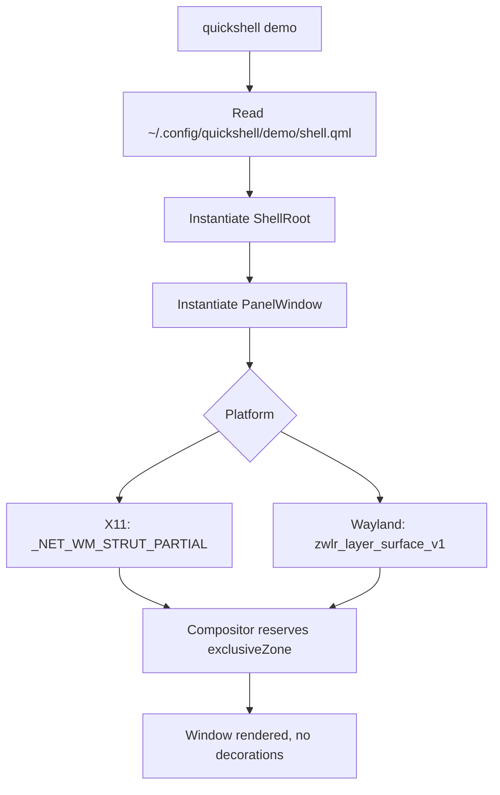

<ChapterMeta reading-time="8 min" :difficulty="1" :prerequisites="['Basic familiarity with QML syntax']" you-will-build="A minimal shell that places a panel on screen" />

## The Problem

You have written a few QML applications before -- maybe a media player or a launcher. You know how to define a `Rectangle`, bind its `color` to a `Slider` value, and wire up a few `onClicked` handlers. But when you sit down to build a desktop shell, you run into a wall fast.

A shell is not a single window. It is a panel pinned to the edge of the screen, a wallpaper layer behind your icons, widgets that float over everything, and popups that appear on key presses -- all running in the same process, communicating with each other. If you try to express this with raw `Window {}` elements, nothing works the way you want. The panel has a title bar and a close button. The wallpaper disappears when you click on the desktop. There is no way to anchor a window to a screen edge without computing pixel offsets yourself.

You need a framework that understands what a shell is.

## The Naive Approach

Most newcomers start by declaring a `Window` for the panel and another `Window` for the wallpaper, then try to hide the decorations with a platform flag.

<BuildIt heading="Naive approach">

```qml
// Naive -- will not work correctly
import QtQuick.Window 2.15

Window {
  flags: Qt.FramelessWindowHint
  x: 0; y: 0
  width: Screen.width; height: 48
  color: "#1e1e2e"
}
```

</BuildIt>

This window still appears in the taskbar, steals focus when clicked, and has no way to tell the compositor "I am a panel -- reserve space for me." You end up fighting the window manager instead of working with it. The window may also render incorrectly when your screen resolution changes or when a monitor is plugged in.

## MentalModel: A Shell is a Scope

The key insight Quickshell gives you is that a shell is not a loose collection of windows -- it is a **scope** that owns windows, shares state, and lives for the duration of the user's session.

Think of `ShellRoot` as the trunk of a tree. Every `PanelWindow` and `FloatingWindow` is a branch. State that belongs to the shell as a whole -- configuration data, shared models, theme colours -- lives on the trunk and is visible to every branch. When the trunk is destroyed (the shell exits), every window goes with it.

ShellRoot is the parent of all shell windows. When the shell exits, every window goes with it. You never have to manually track which windows are open or remember to close them on shutdown.

## The Idea

Quickshell adds three big pieces that raw QML does not have:

1. **Shell window types** -- `PanelWindow` attaches to a screen edge without decorations and can reserve space so other windows do not overlap it. `FloatingWindow` is a normal OS window that you can move and resize programmatically.

2. **A root scope** -- `ShellRoot` is the owning context for your entire shell. It is also a `Scope`, so any property you declare on it is visible to every child window without explicit binding paths.

3. **A config convention** -- Quickshell looks for QML files in `~/.config/quickshell/&lt;name&gt;/shell.qml`. Each subfolder is a separate config you can switch between. No build step, no manifest file, just a QML file at a known path.

Together these mean you write declarative QML for each piece of your shell, and Quickshell handles process lifecycle, window decoration removal, screen-edge anchoring, and compositor integration.

## Let's Build It

The simplest possible shell is a single panel window sitting at the top of the screen.

<BuildIt>

```qml
import Quickshell

ShellRoot {
  PanelWindow {
    anchors.top = true
    anchors.left = true
    anchors.right = true
    height: 48
    color: "#1e1e2e"

    Text {
      text: "my first shell"
      color: "#cdd6f4"
      anchors.centerIn: parent
    }
  }
}
```

</BuildIt>

Place this in `~/.config/quickshell/demo/shell.qml` and run `quickshell demo`. A decorationless bar appears at the top of the screen and stays there. No title bar, no close button, no taskbar entry -- just a 48-pixel strip with the text "my first shell" centred in it.

## Let's Improve It

The panel above works, but it covers the top of maximised windows. You should tell the compositor to reserve that space.

<BuildIt heading="Improved panel with exclusive zone">

```qml
PanelWindow {
  anchors.top: true
  anchors.left: true
  anchors.right: true
  height: 48
  exclusiveZone: 48       // reserve this many pixels
  exclusionMode: ExclusionMode.Auto
  color: "#1e1e2e"
}
```

</BuildIt>

`exclusiveZone` tells the compositor "do not place windows in this region." When set to `48`, maximised windows will stop 48 pixels below the top of the screen. `exclusionMode: Auto` means the reservation is active whenever the window is visible.

You can also toggle `aboveWindows: false` if you want regular windows to be able to overlap the panel -- useful for a wallpaper layer.

<CommonMistake>

**Forgetting `anchors` on PanelWindow.** Without at least one anchor set to `true`, the panel still has no title bar or borders, but the compositor does not know where to place it. The window may appear at an arbitrary position or not at all. Always anchor at least two adjacent edges (e.g. `anchors.top` and `anchors.left`) or both left and right for a full-width bar.

</CommonMistake>

## Under the Hood

When Quickshell loads your `shell.qml`, it parses the file and instantiates the component tree. `ShellRoot` becomes the root context object -- every QML binding resolution starts here. The `PanelWindow` element maps to an internal window manager representation that:

- Sets `Qt.FramelessWindowHint` and `BypassWindowManagerHint` (or the Wayland equivalent, `zwlr_layer_surface_v1`) depending on the platform.
- Calculates the absolute screen position from the `anchors` properties and the current screen geometry.
- Registers the `exclusiveZone` with the compositor so it participates in available work-area calculation.
- Suppresses standard OS chrome and taskbar entries.

On X11, Quickshell uses `_NET_WM_STRUT_PARTIAL` to reserve space. On Wayland, it uses the layer-shell protocol. The same `PanelWindow` QML element compiles to the correct backend code without you changing anything.

<UnderTheHood>
The `anchors` properties -- `top`, `bottom`, `left`, `right` -- are not related to QML's `Item.anchors` system. They are boolean flags that tell Quickshell which screen edges the window should stick to. Setting `anchors.top = true` without `anchors.bottom` means the panel is pinned to the top edge and its height is explicit, not stretched.
</UnderTheHood>

<ProfessionalTip>

If you want a panel that spans only part of the screen width, set `anchors.left = true` (or `anchors.right = true`) and give it an explicit `width`. The window will sit flush against that edge without extending to the opposite side.

</ProfessionalTip>

## Diagram



## Exercises

<ExerciseBlock :difficulty="1">

Create a `PanelWindow` anchored to the bottom of the screen that is 36 pixels tall and shows the current time using `Qt.formatTime`.

</ExerciseBlock>

<ExerciseBlock :difficulty="2">

Add a second `PanelWindow` anchored to the left edge of the screen, 200 pixels wide, with `exclusiveZone` set so that maximised windows do not overlap it. Verify by running a maximised terminal alongside.

</ExerciseBlock>

<ExerciseBlock :difficulty="3">

Write a `FloatingWindow` that opens a 400x300 window with a title and a button. When the button is clicked, call `startSystemMove()` so the user can drag the window by the button. Then add a second button that calls `startSystemResize(Qt.RightEdge | Qt.BottomEdge)`.

</ExerciseBlock>

<Recap :points="['Quickshell provides PanelWindow and FloatingWindow', 'ShellRoot is the owning scope for all shell windows', 'PanelWindow uses anchor booleans to attach to screen edges', 'exclusiveZone and exclusionMode control compositor reservation', 'No build step -- just a shell.qml file in a config directory']" next-chapter="/part-2-quickshell/shell-qml-and-shellroot" />

<!--
Sources verified:
- https://quickshell.org/ -- ShellRoot extends Scope, PanelWindow/QsWindow, anchor booleans, exclusiveZone, exclusionMode
-->
