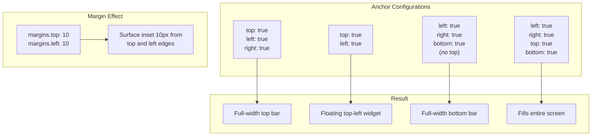

<ChapterMeta reading-time="7 min" :difficulty="2" :prerequisites="['PanelWindow']" you-will-build="A panel that adapts its size and position using anchors and margins" />

## The Problem

A panel window has no title bar and no window manager decorations. There's no close button, no resize handle, and no title bar to drag. The compositor decides where the panel goes based on instructions from the client. If you want a panel at the top, you need to say "top." If you want it 10 pixels from the left edge, you need margins.

But these "anchors" for shell windows work differently from QML's `Item.anchors` — they are boolean flags sent to the compositor, not references to other QML objects.

## The Naive Approach

Trying to use QML `Item.anchors` to position a `PanelWindow`:

```qml
PanelWindow {
  anchors {
    left: parent.left     // PanelWindow has no visual parent in the QML sense
    right: parent.right
    top: parent.top
  }
  // This will cause an error or be silently ignored
}
```

This doesn't work because `PanelWindow` extends `QsWindow`, not `Item`. Its `anchors` property is the Layer Shell anchor bitfield, not the Qt Quick anchor system. The two share the name but are completely different mechanisms.

<MentalModel>

Imagine you're hanging a picture frame. QML anchors are like nails on the wall — you hook the frame's edge onto them. Layer Shell anchors are like choosing which wall to hang the picture on. You don't say "hook the top edge to the ceiling molding" — you say "hang it on the north wall, top edge." The booleans select the wall and alignment.

</MentalModel>

## The Idea

`PanelWindow`'s `anchors` property has four boolean sub-properties: `top`, `bottom`, `left`, `right`. Setting any of them to `true` tells the composizer: "attach this surface to that screen edge." You can set multiple flags to stretch the panel across edges.

- `anchors.top: true` — attach to the top edge. The panel extends from the top corners.
- `anchors.top: true; anchors.left: true` — attach to the top-left corner.
- `anchors.top: true; anchors.bottom: true` — stretch vertically (for a sidebar that spans the full height).
- `anchors.left: true; anchors.right: true; anchors.top: true` — span the full top edge (typical top bar).

The `margins` property (also on `PanelWindow`) sets spacing from screen edges, with `left`, `top`, `right`, `bottom` sub-properties.

## Let's Build It

Let's create panels in different configurations to see how anchors and margins work:

<BuildIt>

```qml
import Quickshell
import QtQuick

// Top panel — spans full width, 10px from each side
PanelWindow {
  id: topPanel

  height: 36
  anchors {
    top: true
    left: true
    right: true
  }
  margins {
    top: 8
    left: 8
    right: 8
  }
  exclusiveZone: height + margins.top

  Rectangle {
    anchors.fill: parent
    color: "#1a1b26"
    radius: 8

    Text {
      text: "Rounded top bar with margins"
      anchors.centerIn: parent
      color: "#c0caf5"
      font.pixelSize: 13
    }
  }
}

// Bottom-left corner widget — small rectangle stuck to bottom-left
PanelWindow {
  width: 200
  height: 48
  anchors {
    bottom: true
    left: true
  }
  margins {
    bottom: 12
    left: 12
  }
  exclusiveZone: 0

  Rectangle {
    anchors.fill: parent
    color: "#24283b"
    radius: 8

    Text {
      text: " Bottom Left"
      anchors.centerIn: parent
      color: "#a9b1d6"
      font.pixelSize: 12
    }
  }
}

// Right sidebar — stretches full height
PanelWindow {
  width: 48
  anchors {
    top: true
    right: true
    bottom: true
  }
  margins {
    top: 8
    right: 8
    bottom: 8
  }
  exclusiveZone: width + margins.right

  Rectangle {
    anchors.fill: parent
    color: "#1a1b26"
    radius: 8

    Column {
      anchors.centerIn: parent
      spacing: 16

      Text { text: ""; color: "#7aa2f7"; font.pixelSize: 18 }
      Text { text: ""; color: "#9ece6a"; font.pixelSize: 18 }
      Text { text: ""; color: "#e0af68"; font.pixelSize: 18 }
      Text { text: ""; color: "#bb9af7"; font.pixelSize: 18 }
    }
  }
}
```

</BuildIt>

## Let's Improve It

Dynamic anchor changes at runtime let you hide and show panels with animation:

```qml
PanelWindow {
  id: sidebar

  width: 200
  anchors {
    top: true
    bottom: true
  }
  property bool isVisible: true

  // Animate the panel sliding in/out by changing the anchor
  states: [
    State {
      name: "hidden"
      when: !sidebar.isVisible
      PropertyChanges {
        target: sidebar
        anchors.left: false
        margins.left: -sidebar.width  // Push off-screen
      }
    },
    State {
      name: "visible"
      when: sidebar.isVisible
      PropertyChanges {
        target: sidebar
        anchors.left: true
        margins.left: 0
      }
    }
  ]

  transitions: Transition {
    NumberAnimation {
      properties: "margins.left"
      duration: 200
      easing.type: Easing.OutCubic
    }
  }

  Rectangle {
    anchors.fill: parent
    color: "#1a1b26"
    // Content...
  }
}
```

<CommonMistake>

**Confusing `anchors` (Layer Shell) with `Item.anchors` (Qt Quick).** The `anchors` block on `PanelWindow` sets layer shell anchors (booleans). Inside the panel, child items use `Item.anchors` (QML anchor lines). They happen to share the property name but are entirely different systems.

**Setting contradictory anchors.** You can set `anchors.top: true` and `anchors.bottom: true` on a panel with fixed height — but the compositor will respect the height and center it vertically between top and bottom edges. This may not be the behavior you expect.

**Forgetting that margins increase exclusive zone.** If you set `margins.top: 8` on a top panel with `exclusiveZone: height`, the actual space reserved is `height + margins.top`. Factor margins into your exclusive zone calculation, or set `exclusiveZone` to a value that accounts for the margin.

</CommonMistake>

## Under the Hood

When a `PanelWindow` is created with anchors, Quickshell translates the boolean flags into the `zwlr_layer_surface_v1.anchor` bitfield:

```
anchors.top: true    → ZWLR_LAYER_SURFACE_V1_ANCHOR_TOP    = 1
anchors.bottom: true → ZWLR_LAYER_SURFACE_V1_ANCHOR_BOTTOM = 2
anchors.left: true   → ZWLR_LAYER_SURFACE_V1_ANCHOR_LEFT   = 4
anchors.right: true  → ZWLR_LAYER_SURFACE_V1_ANCHOR_RIGHT  = 8
```

These flags are sent to the compositor during surface commit. The compositor positions the surface accordingly: a surface anchored to `left | right | top` is stretched to fill the full top edge. A surface anchored to `left | bottom` is positioned at the bottom-left corner with its natural size.

The `margins` are sent via `zwlr_layer_surface_v1.set_margin`, which takes four integers for top, right, bottom, left. The compositor offsets the surface from each anchored edge by the corresponding margin value.

<UnderTheHood>

When no anchors are set, the layer surface is centered on the screen. The compositor places it at the center of the output, using its natural size. This is sometimes useful for centered popups or splash screens.

</UnderTheHood>

<ProfessionalTip>

For a floating panel (one that does not stretch to edges), set only one or two anchors. For example, `anchors.top: true; anchors.left: true` with a fixed width and height creates a floating panel attached to the top-left corner. This is useful for status widgets that you want positioned at a screen corner but not spanning the full edge.

</ProfessionalTip>

## Diagram



## Exercises

<ExerciseBlock :difficulty="1">
Create a `PanelWindow` anchored to the bottom edge with `margins.bottom: 8`. Give it a height of 40 and a background color of `#1a1b26`.
</ExerciseBlock>

<ExerciseBlock :difficulty="2">
Build a top-right corner clock widget: `PanelWindow` with `anchors.top: true`, `anchors.right: true`, width of 160, height of 36, and `margins.right: 12`, `margins.top: 12`. Display the current time inside.
</ExerciseBlock>

<ExerciseBlock :difficulty="3">
Create a `PanelWindow` that spans the full left side (`anchors.left: true`, `anchors.top: true`, `anchors.bottom: true`) with `margins` of 4 on all sides. Inside, place a `ListView` of workspace names. The panel should have rounded corners on all four sides (use `Rectangle` with `radius`).
</ExerciseBlock>

<Recap :points="['PanelWindow anchors are booleans that attach to screen edges, not QML anchor lines', 'Set multiple anchors to stretch surfaces across edges', 'Margins inset the surface from each anchored edge', 'Exclusive zone should account for margins', 'Runtime changes to anchors and margins are supported']" next-chapter="/part-3-windows/multi-monitor-support" />

<!--
Sources verified for this chapter:
- https://quickshell.org/docs/v0.3.0/types/Quickshell/PanelWindow/ — PanelWindow anchor properties
- https://wayland.app/protocols/wlr-layer-shell-unstable-v1 — set_anchor and set_margin
- https://quickshell.org/docs/v0.3.0/guide/qml-language/ — QML Language
-->
