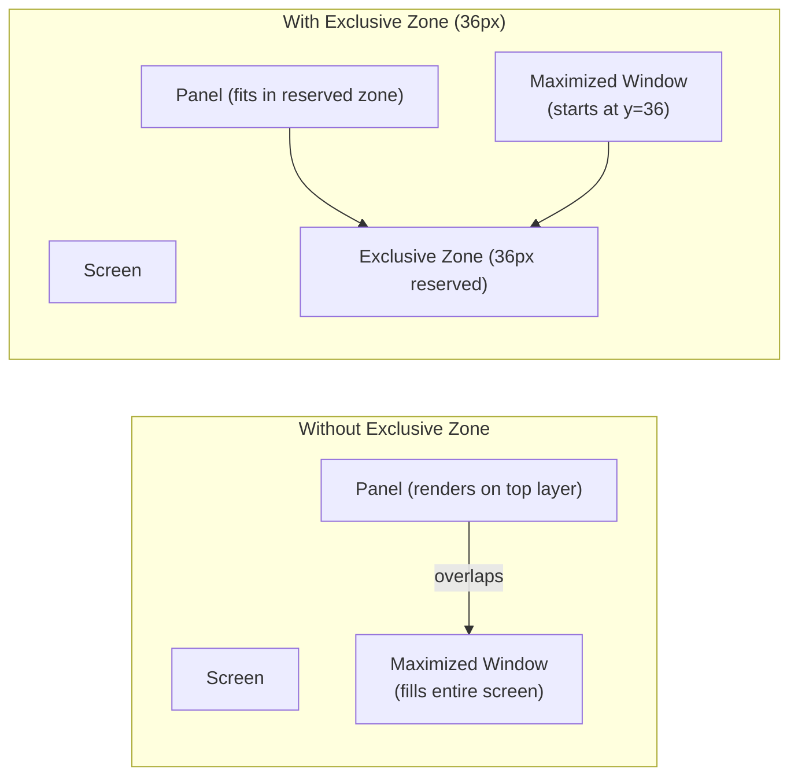

<ChapterMeta reading-time="8 min" :difficulty="2" :prerequisites="['PanelWindow', 'Layer Shell Concepts']" you-will-build="A panel with togglable exclusive zone and exclusion mode" />

## The Problem

When you place a panel at the top of the screen, maximized application windows should not overlap it. The panel needs to tell the compositor: "I occupy this strip of the screen. Treat it as unavailable for other windows."

This is the **exclusive zone** — an integer that represents how many pixels of screen space the surface claims.

## The Naive Approach

Setting the panel's height and hoping other windows avoid it:

```qml
PanelWindow {
  height: 36
  anchors.top: true
  // No exclusiveZone set — defaults to 0
}
```

Without an exclusive zone, the compositor treats the panel as an overlay. Maximized windows ignore it and render behind it. The panel is visible (because it's on the `top` layer), but any clickable content in the top 36 pixels of a maximized window is covered.

The result: your panel floats above the top of a maximized browser's content area, obscuring the tab bar or URL field.

<MentalModel>

Imagine a parking lot. Without exclusive zones, cars (windows) park anywhere, including the space right in front of the entrance (the panel area). An exclusive zone is like painting a fire lane — cars cannot park there. The lane is reserved even if the fire truck (panel) isn't currently parked in it.

</MentalModel>

## The Idea

The `exclusiveZone` property on `PanelWindow` tells the compositor to reserve a specified number of pixels on the anchored edge. When a window requests to be maximized or tiled, the compositor reduces the available workspace area by the exclusive zone.

```qml
PanelWindow {
  height: 36
  anchors.top: true
  exclusiveZone: 36  // Reserve 36px from the top edge
}
```

Now maximized windows have their top boundary set to `y = 36` instead of `y = 0`. The panel and the windows coexist without overlap.

## ExclusionMode

The `ExclusionMode` enum refines how the exclusive zone is applied:

| Mode | Behavior |
|------|----------|
| `ExclusionMode.Auto` | Compositor decides based on anchors. Usually applies exclusive zone if the surface is anchored to one or more edges. |
| `ExclusionMode.Normal` | Always apply the exclusive zone. Use for standard panels. |
| `ExclusionMode.Ignore` | Ignore the exclusive zone entirely. Use for overlays and floating widgets that should not affect window layout. |

## Let's Build It

Let's compare different exclusive zone configurations:

<BuildIt>

```qml
import Quickshell
import QtQuick

// Panel that reserves no space — windows go underneath
PanelWindow {
  id: overlayPanel
  height: 36
  anchors { top: true; left: true; right: true }
  exclusiveZone: 0
  exclusionMode: ExclusionMode.Ignore

  Rectangle {
    anchors.fill: parent
    color: "#80f7768e"  // Semi-transparent red

    Text {
      text: "Overlay Panel (no exclusive zone)"
      anchors.centerIn: parent
      color: "white"
      font.pixelSize: 12
    }
  }
}

// Panel that reserves space — windows avoid it
PanelWindow {
  id: exclusivePanel
  height: 36
  anchors { top: true; left: true; right: true }
  exclusiveZone: 36
  exclusionMode: ExclusionMode.Normal

  Rectangle {
    anchors.fill: parent
    color: "#1a1b26"

    Text {
      text: "Exclusive Panel (reserves 36px)"
      anchors.centerIn: parent
      color: "#c0caf5"
      font.pixelSize: 12
    }
  }
}
```

Run this with a maximized window visible. On the overlay panel's monitor, the window extends behind the red bar. On the exclusive panel's monitor, the window stops at pixel 36.

</BuildIt>

## Let's Improve It

Toggle exclusive zone at runtime to temporarily disable space reservation:

```qml
PanelWindow {
  id: togglablePanel

  height: 36
  anchors { top: true; left: true; right: true }

  property bool reserved: true

  exclusiveZone: reserved ? height : 0
  exclusionMode: reserved ? ExclusionMode.Normal : ExclusionMode.Ignore

  Rectangle {
    anchors.fill: parent
    color: reserved ? "#1a1b26" : "#3b4261"

    Text {
      text: reserved ? " Exclusive (click to release)" : " Overlay (click to reserve)"
      anchors.centerIn: parent
      color: "#c0caf5"
      font.pixelSize: 12
    }

    MouseArea {
      anchors.fill: parent
      onClicked: togglablePanel.reserved = !togglablePanel.reserved
    }
  }
}
```

Clicking the panel toggles between reserved and overlay mode. When in overlay mode, maximized windows stretch behind it. When in reserved mode, the compositor re-layouts the workspace.

This pattern is useful for auto-hiding panels: set `exclusiveZone` to 0 when hidden and restore it when visible.

<CommonMistake>

**Setting `exclusiveZone` smaller than the panel's visible size.** If a panel is 36px tall but `exclusiveZone` is set to 20, maximized windows will overlap the bottom 16px of the panel. Always set `exclusiveZone` equal to the full extent of the space your panel occupies (height + relevant margins).

**Using `ExclusionMode.Auto` without checking its effect.** Different compositors interpret `Auto` differently. For predictable behavior, explicitly set `ExclusionMode.Normal` or `ExclusionMode.Ignore`.

**Not updating `exclusiveZone` when panel size changes.** If you animate or resize the panel at runtime, update `exclusiveZone` in the same frame. Delay in updating causes temporary overlap.

</CommonMistake>

## Under the Hood

The exclusive zone mechanism is part of the `zwlr_layer_surface_v1` protocol. When the compositor receives a surface with a non-zero exclusive zone, it:

1. Determines the affected edge(s) from the anchor flags.
2. Reduces the available workspace (the "work area") by the exclusive zone amount.
3. Sends new configure events to all maximized/fullscreen/tiled surfaces with the updated work area geometry.
4. The affected windows redraw to fit the new bounds.

For `ExclusionMode.Ignore`, the compositor skips step 2-4. The surface is still rendered at the correct position, but it's treated as a visual overlay that doesn't affect layout.

When you change `exclusiveZone` at runtime, the compositor re-evaluates the work area. This can cause visible re-layout of existing windows.

<UnderTheHood>

The exclusive zone value is a signed 32-bit integer. Negative values are treated the same as 0 by most compositors. Very large values (greater than the output geometry) effectively reserve the entire screen, leaving the work area at 1 pixel — useful for special effects like fullscreen overlays.

</UnderTheHood>

<ProfessionalTip>

For an auto-hiding panel, use a `Behavior` on `exclusiveZone` to avoid abrupt re-layouts:

```qml
exclusiveZone: panelVisible ? height : 0

Behavior on exclusiveZone {
  NumberAnimation { duration: 200 }
}
```

Note: the exclusive zone animation affects window re-layout, not the panel itself. Animate the panel's `margins` or `y` offset separately for the visual slide effect.

</ProfessionalTip>

## Diagram



## Exercises

<ExerciseBlock :difficulty="1">
Create a `PanelWindow` at the bottom edge with a height of 40. Set `exclusiveZone: 0` and observe how a maximized window behaves. Then change `exclusiveZone: 40` and see the difference.
</ExerciseBlock>

<ExerciseBlock :difficulty="2">
Build a top panel with a toggle button that switches between `ExclusionMode.Normal` and `ExclusionMode.Ignore`. Display the current mode in the panel. Open a maximized window in another workspace and test the toggle.
</ExerciseBlock>

<ExerciseBlock :difficulty="3">
Create a panel that auto-hides after 3 seconds of inactivity (no mouse movement). When hidden, its `exclusiveZone` is 0 and the panel slides out via margins animation. When the mouse approaches the screen edge, the panel slides back in and restores its exclusive zone. Use `Timer` for the inactivity detection.
</ExerciseBlock>

<Recap :points="['exclusiveZone reserves screen space from the anchored edge', 'ExclusionMode controls how the compositor applies the exclusive zone', 'Always set exclusiveZone equal to the panel height + relevant margins', 'Runtime changes to exclusiveZone trigger compositor re-layout', 'Auto-hiding panels should toggle exclusiveZone between 0 and height']" next-chapter="/part-3-windows/transparency-and-blur" />

<!--
Sources verified for this chapter:
- https://quickshell.org/docs/v0.3.0/types/Quickshell/PanelWindow/ — PanelWindow exclusionZone
- https://wayland.app/protocols/wlr-layer-shell-unstable-v1 — set_exclusive_zone
- https://quickshell.org/docs/v0.3.0/guide/qml-language/ — QML Language
-->
