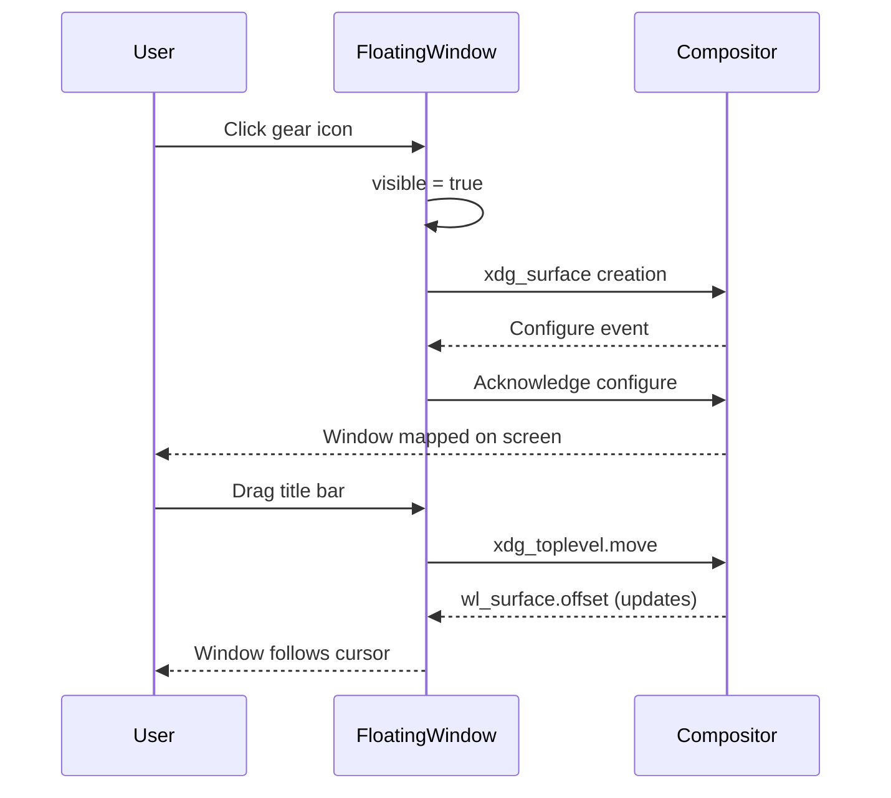

<ChapterMeta reading-time="7 min" :difficulty="2" :prerequisites="['PanelWindow']" you-will-build="A draggable floating dashboard window" />

## The Problem

Not every shell surface should be a panel stuck to the edge of the screen. Sometimes you need a proper window that the user can move, resize, minimize, or maximize — a settings dashboard, a launcher overlay, or a media player. You need a standard OS toplevel window, but one that you control entirely from Quickshell.

## The Naive Approach

A `PanelWindow` with no anchors creates a free-floating surface, but it's still a layer shell surface — the compositor may treat it differently from a regular application window. It won't have a title bar, can't be minimized by the user, and won't appear in the window manager's task list the same way normal windows do.

```qml
// PanelWindow without anchors is an awkward middle-ground:
PanelWindow {
  // no anchors set — floats, but still a layer surface
  width: 400; height: 300
  // no title bar, no minimize/maximize buttons
}
```

The compositor places it, not the user. That's fine for panels but wrong for interactive windows.

<MentalModel>

Imagine a museum. Panels are the wall labels — fixed in place, informative, always visible. Floating windows are display cases — you can walk around them, open them, close them, and move them where you want. They have their own frame and behave like independent objects in the space.

</MentalModel>

## The Idea

`FloatingWindow` is Quickshell's type for standard OS toplevel windows. It extends `QsWindow` and gives you a proper window with all the expected behaviors: title bar, move/resize, minimize/maximize/fullscreen, and proper window manager integration. Use it whenever you need a window that feels like a native application window.

```qml
import Quickshell

FloatingWindow {
  title: "Dashboard"
  width: 600
  height: 400
  visible: true
}
```

## Let's Build It

Let's create a floating settings dashboard that can be toggled with a keyboard shortcut:

<BuildIt>

```qml
import Quickshell
import QtQuick
import QtQuick.Layouts

FloatingWindow {
  id: dashboard

  title: "Dashboard"
  width: 520
  height: 360
  minimumSize: Qt.size(300, 200)
  visible: false

  Rectangle {
    anchors.fill: parent
    color: "#1a1b26"
    radius: 6

    ColumnLayout {
      anchors {
        fill: parent
        margins: 16
      }
      spacing: 12

      Text {
        text: "Dashboard"
        font.pixelSize: 20
        font.bold: true
        color: "#c0caf5"
      }

      Rectangle {
        Layout.fillWidth: true
        Layout.preferredHeight: 1
        color: "#3b4261"
      }

      RowLayout {
        spacing: 8

        Text { text: " Wi-Fi"; color: "#9ece6a" }
        Text { text: "Connected"; color: "#565f89" }
        Item { Layout.fillWidth: true }
        Text { text: " Volume: 75%"; color: "#e0af68" }
      }

      Item { Layout.fillHeight: true }

      Text {
        text: "Press Super+D to toggle"
        color: "#565f89"
        font.pixelSize: 11
        horizontalAlignment: Text.AlignHCenter
        Layout.fillWidth: true
      }
    }
  }
}
```

</BuildIt>

## Let's Improve It

Add interactive features — make the window draggable by its title area and resizable:

```qml
FloatingWindow {
  id: dashboard

  title: "Dashboard"
  width: 520
  height: 360
  minimumSize: Qt.size(300, 200)
  maximized: false

  Rectangle {
    anchors.fill: parent
    color: "#1a1b26"
    radius: 6

    // Custom title bar
    Rectangle {
      id: titleBar
      anchors {
        top: parent.top
        left: parent.left
        right: parent.right
      }
      height: 36
      color: "#16161e"
      radius: 6

      MouseArea {
        anchors.fill: parent
        onPressed: dashboard.startSystemMove()
      }

      Text {
        text: " Dashboard"
        anchors {
          left: parent.left
          verticalCenter: parent.verticalCenter
          leftMargin: 12
        }
        color: "#a9b1d6"
        font.pixelSize: 13
      }

      Row {
        anchors {
          right: parent.right
          verticalCenter: parent.verticalCenter
          rightMargin: 8
        }
        spacing: 4

        Rectangle {
          width: 12; height: 12; radius: 6
          color: "#e0af68"
          MouseArea {
            anchors.fill: parent
            onClicked: dashboard.minimized = true
          }
        }
        Rectangle {
          width: 12; height: 12; radius: 6
          color: "#9ece6a"
          MouseArea {
            anchors.fill: parent
            onClicked: dashboard.maximized = !dashboard.maximized
          }
        }
        Rectangle {
          width: 12; height: 12; radius: 6
          color: "#f7768e"
          MouseArea {
            anchors.fill: parent
            onClicked: dashboard.visible = false
          }
        }
      }
    }

    // Resize handle
    Rectangle {
      anchors {
        bottom: parent.bottom
        right: parent.right
      }
      width: 16; height: 16
      color: "#3b4261"
      radius: 2

      MouseArea {
        anchors.fill: parent
        onPressed: dashboard.startSystemResize(Qt.BottomEdge | Qt.RightEdge)
      }
    }
  }

  // Toggle visibility shortcut
  Shortcut {
    sequence: "Super+D"
    onActivated: dashboard.visible = !dashboard.visible
  }
}
```

<CommonMistake>

**Using `startSystemResize` with wrong edges.** The `edges` parameter must be a bitwise OR of `Qt.TopEdge`, `Qt.BottomEdge`, `Qt.LeftEdge`, `Qt.RightEdge`. Using a single edge like `Qt.BottomEdge` is valid but restricts resizing to one direction.

**Forgetting `minimumSize`.** Without it, the user can resize the window to zero width or height, which can break your layout. Always set a reasonable `minimumSize`.

**Setting `visible: true` unconditionally.** Floating windows like dashboards should start hidden. Let a shortcut or service control their visibility.

</CommonMistake>

## Under the Hood

`FloatingWindow` creates a standard `xdg_toplevel` surface (on Wayland) or a regular OS window (on X11). It implements the `xdg_surface` protocol, which provides:

- Maximize/minimize/fullscreen state management
- Interactive move and resize (via `startSystemMove()` and `startSystemResize()`)
- Window geometry negotiation with the compositor
- Title and app ID for the window manager

The `parentWindow` property lets you set a transient parent (e.g., a popup tied to a panel), which the compositor may use for stacking and positioning hints.

<UnderTheHood>

The `startSystemMove()` call sends an `xdg_toplevel.move` request to the compositor. For the duration of the move, the compositor sends `wl_surface.offset` events so the client can track its position. `startSystemResize()` similarly sends `xdg_toplevel.resize` with the edge bitmask.

</UnderTheHood>

<ProfessionalTip>

For a always-on-top floating window (like a picture-in-picture player), use `FloatingWindow` with no parent and keep it above other windows by toggling the compositor's layer through the `WlrLayershell` layer property. Most compositors respect `aboveWindows` on layer surfaces but for `xdg_toplevel` surfaces, use the compositor's own pin-to-top mechanism.

</ProfessionalTip>

## Diagram



## Exercises

<ExerciseBlock :difficulty="1">
Create a `FloatingWindow` that displays system info (OS name, kernel version, uptime). Set a minimum size of 400x300 and a title of "System Info". Make it resizable.
</ExerciseBlock>

<ExerciseBlock :difficulty="2">
Add a maximize/minimize button pair to the dashboard window. Use the `maximized` and `minimized` properties. Add a `Shortcut` for `Super+Escape` that closes the window.
</ExerciseBlock>

<ExerciseBlock :difficulty="3">
Build a pop-out media player with `parentWindow` set to a panel. Use `startSystemMove()` to drag it by a custom title bar and `startSystemResize()` for each edge and corner. Include `minimumSize` and `maximumSize` constraints.
</ExerciseBlock>

<Recap :points="['FloatingWindow creates standard OS toplevel windows backed by xdg_toplevel', 'Use startSystemMove() and startSystemResize() for interactive window manipulation', 'Control maximize, minimize, fullscreen, and visibility programmatically', 'Set minimumSize and maximumSize to prevent layout breakage', 'Use floating windows for dashboards, launchers, settings panels, and pop-out widgets']" next-chapter="/part-3-windows/popup-window" />

<!--
Sources verified for this chapter:
- https://wayland.app/protocols/xdg-shell — xdg-shell protocol
- https://quickshell.org/docs/v0.3.0/types/Quickshell/QsWindow — QsWindow base class
- https://doc.qt.io/qt-6/qtqml-syntax-objectattributes.html — QML Object Attributes
-->
