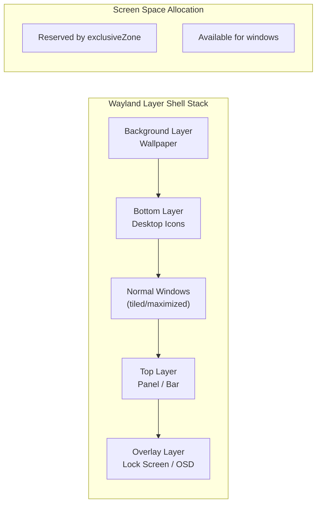

<ChapterMeta reading-time="9 min" :difficulty="2" :prerequisites="['PanelWindow', 'What Is a Desktop Shell?']" you-will-build="No code — a conceptual understanding of layer shell architecture" />

## The Problem

Wayland is a secure, modern display protocol, but it deliberately restricts what clients can do. A normal Wayland client cannot:

- Know its own position on screen
- Move itself to a specific coordinate
- Create a window without a title bar
- Reserve screen space from other windows

These restrictions are by design — they prevent malicious clients from pretending to be UI elements of other applications. But they also prevent you from building a desktop shell. Shell components (panels, lock screens, wallpapers) need these capabilities.

## The Naive Approach

The X11 approach was to give everything to everyone. Any client could set its own position, change its window type, and override the window manager's decisions. This made building shells easy but created security and reliability problems. A badly-behaved app could draw fake UI elements, steal focus, or cover the screen.

Wayland chose the opposite path: zero trust. Normal clients get minimal privileges. Shell components get a separate, privileged protocol — the **Layer Shell**.

<MentalModel>

Think of Wayland as a secure building. Regular application windows are tenants — they have keys to their own apartments but cannot modify the building's structure, set up signs in the lobby, or reserve parking spaces. The Layer Shell is a maintenance contract that lets authorized workers (the shell) install signs, set up lighting, and mark areas as off-limits.

</MentalModel>

## The Idea

The **Wayland Layer Shell protocol** (`zwlr_layer_shell_v1`) is an extension specifically for desktop shell components. It defines:

- **Layers** — a stacking order (background, bottom, top, overlay) that determines which surfaces render above or below others.
- **Anchors** — boolean flags that attach a surface to screen edges (top, bottom, left, right).
- **Exclusive zones** — an integer indicating how much space the surface reserves (pushing other windows away).
- **Margins** — per-edge spacing from the screen edge.

Quickshell exposes all of this through `PanelWindow` and the `WlrLayershell` object. The protocol is implemented by most Wayland compositors (Hyprland, Sway, River, Wayfire, KWin).

## The Layer Stack

Surfaces in the Layer Shell are arranged in four ordered layers:

| Layer | Purpose | Typical Use |
|-------|---------|-------------|
| `Background` | Behind everything | Wallpaper, desktop background |
| `Bottom` | Below normal windows | Desktop icons, widgets |
| `Top` | Above normal windows | Panels, bars, docks |
| `Overlay` | Above everything | Lock screens, OSD popups, notifications |

Within each layer, surfaces are stacked in the order they are committed. The compositor may reorder surfaces within a layer based on focus or other criteria.

## WlrLayer Enum

Quickshell represents the four layers with the `WlrLayer` enum, accessible from `Quickshell.Wayland`:

- `WlrLayer.Background`
- `WlrLayer.Bottom`
- `WlrLayer.Top`
- `WlrLayer.Overlay`

You can query or set a `PanelWindow`'s layer through the `WlrLayershell` manager:

```qml
import Quickshell
import Quickshell.Wayland

WlrLayershell {
  id: layershell

  function setWindowLayer(window, layer) {
    // internal API to reassign layer at runtime
  }
}
```

## Exclusive Zones in Depth

The exclusive zone is one of the Layer Shell's most important concepts. It tells the compositor: "Reserve this many pixels of screen space for me — no other window should use this area."

- A top panel with `exclusiveZone: 36` causes maximized windows to have their top edge at y = 36.
- A bottom panel with `exclusiveZone: 30` limits maximized window bottom to screen height - 30.
- A left sidebar with `exclusiveZone: 200` shifts windows 200 pixels to the right.

The `ExclusionMode` enum controls how the compositor interprets the exclusive zone:

- `ExclusionMode.Auto` — the compositor decides whether to apply exclusive behavior based on the surface's anchors.
- `ExclusionMode.Normal` — always apply the exclusive zone. Use for regular panels.
- `ExclusionMode.Ignore` — ignore exclusive zone. Use for floating overlays that should not push windows.

## Compositor Support Matrix

| Compositor | Layer Shell | Exclusive Zones | Runtime Changes |
|-----------|-------------|-----------------|-----------------|
| Hyprland   | Full        | Full            | Yes             |
| Sway       | Full        | Full            | Yes             |
| River      | Full        | Full            | Yes             |
| Wayfire    | Full        | Partial         | Yes             |
| KWin       | Supported   | Supported       | Yes             |

<UnderTheHood>

The Layer Shell protocol uses the `wl_compositor` interface to create `wl_surface` objects, then attaches them to the layer shell via `zwlr_layer_shell_v1.get_layer_surface`. The compositor tracks these surfaces and includes them in its render pass, respecting layer order, anchors, and exclusive zones.

When a layer surface changes its `exclusiveZone`, the compositor re-evaluates the available workspace area for all other surfaces and may send new configure events to maximized/tiled windows.

</UnderTheHood>

<ProfessionalTip>

The `overlay` layer is powerful but dangerous. Because it renders above everything, an overlay surface that does not accept keyboard input can block interaction with elements below it. Always set `focusable: false` and ensure your overlay surfaces have a way to be dismissed.

For lock screens, use the `overlay` layer with `exclusionMode: ExclusionMode.Ignore` — you don't want to reserve space; you want to cover everything.

</ProfessionalTip>

## Diagram



## Key Takeaways for Shell Authors

1. **Use `top` or `overlay` layers for interactive shell UI.** Panels go in `top`; lock screens and OSDs go in `overlay`.
2. **Always set an appropriate `exclusiveZone`** for panels that should reserve space.
3. **Use `ExclusionMode.Ignore` for transient overlays** like notifications that should not affect window layout.
4. **Runtime changes are supported** — you can modify anchors, margins, and exclusive zones after the window is mapped.
5. **Different compositors may behave slightly differently** — always test your shell on your target compositor.

## Exercises

<ExerciseBlock :difficulty="1">
Explain the difference between the `top` layer and the `overlay` layer. Give one use case for each.
</ExerciseBlock>

<ExerciseBlock :difficulty="2">
Describe what happens when a PanelWindow with `exclusiveZone: 0`, `anchors.top: true`, and `exclusionMode: ExclusionMode.Normal` is created. Does it reserve space? How is it different from having `exclusionMode: ExclusionMode.Ignore`?
</ExerciseBlock>

<ExerciseBlock :difficulty="3">
You want to build a notification popup that slides in from the top-right, overlays current windows, but does not reserve space and disappears after 5 seconds. Which layer would you use? Which exclusion mode? Write the PanelWindow declaration that achieves this.
</ExerciseBlock>

<Recap :points="['The Layer Shell protocol enables shell components that normal clients cannot create', 'Four layers: background, bottom, top, overlay — controlling z-ordering', 'Anchors attach surfaces to screen edges as booleans', 'Exclusive zones reserve screen space, pushing other windows away', 'ExclusionMode controls how the compositor interprets the exclusive zone']" next-chapter="/part-3-windows/anchors-and-margins" />

<!--
Sources verified for this chapter:
- https://wayland.app/protocols/wlr-layer-shell-unstable-v1 — wlr-layer-shell protocol
- https://quickshell.org/docs/v0.3.0/types/Quickshell/PanelWindow/ — PanelWindow type
- https://quickshell.org/docs/v0.3.0/types/Quickshell/Quickshell/ — Quickshell singleton
-->
