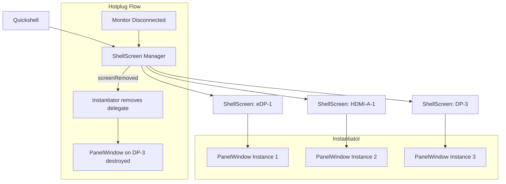

<ChapterMeta reading-time="8 min" :difficulty="3" :prerequisites="['PanelWindow', 'Anchors & Margins']" you-will-build="A per-monitor panel system that works across multiple displays" />

## The Problem

A desktop shell is rarely used on a single monitor. Users connect external displays, rotate screens, and change resolutions. Your shell must:

- Create a panel on every connected monitor — not just the primary one.
- Track monitor hotplug events (when a user plugs in or unplugs a display).
- React to monitor geometry changes (resolution, position, scale).
- Associate per-monitor state (workspaces per output, wallpaper per output).

If you write a single `PanelWindow` without specifying an output, the compositor places it on the primary monitor. Other monitors get nothing.

## The Naive Approach

Hardcoding screen dimensions from `Screen`:

```qml
PanelWindow {
  width: Screen.width   // Only the primary screen
  height: 36
}
```

This ignores non-primary monitors. On a multi-monitor setup, your panel appears only on one display. The user expects bars on all their screens.

Another naive approach: creating separate `PanelWindow` instances manually for each known monitor:

```qml
PanelWindow { screen: 0 }  // May not match the user's layout
PanelWindow { screen: 1 }
```

Hardcoded screen indices break when monitors are rearranged or when a monitor is disconnected.

<MentalModel>

Think of monitors as different rooms in a house. You want the same clock on every wall, but each room might show different information (different workspaces, different wallpapers). You need a system that knows about all rooms, can detect when a room is added or removed, and can place the appropriate UI in each one.

</MentalModel>

## The Idea

Quickshell provides `ShellScreen` — an object that represents a monitor or output. You can enumerate all connected screens, track changes via signals, and create per-output window instances dynamically using `Instantiator`.

The key insight: instead of declaring one `PanelWindow`, declare a `PanelWindow` *component* and instantiate it once per `ShellScreen`.

```qml
import Quickshell

Instantiator {
  model: Quickshell.screens
  delegate: PanelWindow {
    // One panel per screen, automatically
    screen: modelData
    anchors.top: true
    anchors.left: true
    anchors.right: true
    height: 36
  }
}
```

## Let's Build It

Let's build a multi-monitor-aware top panel using `Instantiator` and `ShellScreen`:

<BuildIt>

```qml
import Quickshell
import QtQuick
import QtQuick.Layouts

Instantiator {
  id: panelInstantiator
  model: Quickshell.screens

  delegate: PanelWindow {
    required property var modelData
    screen: modelData

    height: 36
    anchors {
      top: true
      left: true
      right: true
    }
    exclusiveZone: height

    Rectangle {
      anchors.fill: parent
      color: "#1a1b26"

      RowLayout {
        anchors {
          fill: parent
          leftMargin: 12
          rightMargin: 12
        }

        Text {
          text: ""
          font.pixelSize: 16
          color: "#7aa2f7"
        }

        Text {
          text: modelData.name  // e.g., "eDP-1" or "DP-3"
          font.pixelSize: 11
          color: "#565f89"
          Layout.leftMargin: 6
        }

        Item { Layout.fillWidth: true }

        Text {
          text: "%1x%2".arg(modelData.width).arg(modelData.height)
          font.pixelSize: 11
          color: "#565f89"
        }

        Text {
          id: clock
          text: new Date().toLocaleTimeString(Qt.locale(), "HH:mm")
          font.pixelSize: 14
          color: "#c0caf5"
          Layout.leftMargin: 12

          Timer {
            interval: 1000
            running: true
            repeat: true
            onTriggered: {
              clock.text = new Date().toLocaleTimeString(Qt.locale(), "HH:mm")
            }
          }
        }
      }
    }
  }
}
```

</BuildIt>

## Let's Improve It

Per-monitor workspaces require tracking active workspace per output. Let's use a `VariantMap` to store workspace state per screen:

```qml
import Quickshell
import QtQuick

Item {
  // Track active workspace per screen name
  property var workspaceState: ({})

  function setWorkspace(screenName, ws) {
    workspaceState[screenName] = ws
  }

  Instantiator {
    model: Quickshell.screens

    delegate: PanelWindow {
      required property var modelData
      screen: modelData
      screenName: modelData.name

      height: 36
      anchors { top: true; left: true; right: true }
      exclusiveZone: height

      Rectangle {
        anchors.fill: parent
        color: "#1a1b26"

        Row {
          anchors {
            left: parent.left
            verticalCenter: parent.verticalCenter
            leftMargin: 12
          }
          spacing: 6

          Repeater {
            model: 5

            Rectangle {
              width: 8; height: 8
              radius: 4
              color: model.index === (workspaceState[screenName] || 0) ?
                        "#7aa2f7" : "#3b4261"

              MouseArea {
                anchors.fill: parent
                onClicked: setWorkspace(screenName, model.index)
              }
            }
          }
        }

        Text {
          anchors {
            right: parent.right
            verticalCenter: parent.verticalCenter
            rightMargin: 12
          }
          text: clock.text
          color: "#c0caf5"
          font.pixelSize: 14
        }
      }
    }
  }
}
```

To handle screen hotplug, connect to `ShellScreen` signals:

```qml
Connections {
  target: Quickshell.screens

  function onScreenAdded(screen) {
    console.log("Monitor connected:", screen.name)
  }

  function onScreenRemoved(screen) {
    console.log("Monitor disconnected:", screen.name)
  }
}
```

<CommonMistake>

**Not specifying `screen` on PanelWindow.** Without a `screen` assignment, the compositor places the panel on the primary output. With `Instantiator`, always pass `screen: modelData` to ensure each delegate gets the correct screen.

**Assuming `Screen.width` is accurate for all monitors.** In a multi-monitor setup, `Screen` refers to the primary screen's virtual geometry. Always use `ShellScreen.width` and `ShellScreen.height` for per-monitor dimensions.

**Ignoring screen scale.** HiDPI monitors may have fractional scaling (1.5x, 2.0x). The `ShellScreen.scale` property gives you the scale factor. Use it to adjust icon sizes and font sizes for crisp rendering:

```qml
font.pixelSize: 14 * screen.scale
```

</CommonMistake>

## Under the Hood

`Quickshell.screens` is a `QList&lt;ShellScreen*&gt;` model that Quickshell maintains by listening to the Wayland output protocol (`wl_output`). Each `ShellScreen` wraps a `wl_output` resource:

- **`name`** — the compositor-assigned name (e.g., `eDP-1`, `HDMI-A-1`).
- **`description`** — the monitor's EDID description string.
- **`width` / `height`** — the usable size in pixels (may differ from `physicalSize` due to scaling).
- **`scale`** — the scale factor (1, 1.5, 2, etc.).
- **`transform`** — the output transform (normal, 90°, 180°, 270°).

When a `PanelWindow` is assigned a `screen`, Quickshell passes the corresponding `wl_output` resource to `zwlr_layer_shell_v1.get_layer_surface`. The compositor then maps the surface to that specific output. If the output is disconnected, the layer surface is unmapped.

The `Instantiator` approach works because `Quickshell.screens` emits `screenAdded` and `screenRemoved` signals, which cause the `Instantiator` to add or remove delegate instances automatically.

<UnderTheHood>

Each `PanelWindow` instance in the `Instantiator` is a separate Wayland surface with its own `wl_surface` and `zwlr_layer_surface_v1` resources. This is deliberate — each monitor gets an independent surface. You cannot share one surface across multiple outputs in the Layer Shell protocol.

</UnderTheHood>

<ProfessionalTip>

For a multi-monitor setup with different resolutions, use `Screen.width` within each delegate (it correctly resolves to the assigned screen) rather than hardcoding widths:

```qml
PanelWindow {
  screen: modelData
  height: 36
  anchors { top: true; left: true; right: true }
}
```

The compositor will stretch the panel to match the output's horizontal resolution automatically because of the `left | right` anchors.

</ProfessionalTip>

## Diagram



## Exercises

<ExerciseBlock :difficulty="1">
Use `Quickshell.screens` to print the name, resolution, and scale factor of every connected monitor using a `Repeater` and a simple `Text` list.
</ExerciseBlock>

<ExerciseBlock :difficulty="2">
Build an `Instantiator` that creates a `PanelWindow` for each screen. Each panel should show the screen name on the left and a clock on the right. The background color should alternate between two shades for different monitors.
</ExerciseBlock>

<ExerciseBlock :difficulty="3">
Extend the exercise 2 solution to handle screen hotplug. When a screen is added, a new panel should appear automatically. When a screen is removed, the corresponding panel should be destroyed. Use `Connections` to log screen add/remove events to the console.
</ExerciseBlock>

<Recap :points="['Use Quickshell.screens to enumerate all connected monitors', 'Use Instantiator with ShellScreen model to create per-output panels automatically', 'Always set screen: modelData on each PanelWindow delegate', 'Handle screen hotplug via screenAdded and screenRemoved signals', 'Account for screen scale in HiDPI setups']" next-chapter="/part-3-windows/exclusive-zones" />

<!--
Sources verified for this chapter:
- https://quickshell.org/docs/v0.3.0/types/Quickshell/Variants — Variants type
- https://quickshell.org/docs/v0.3.0/types/Quickshell/Quickshell/ — Quickshell.screens
- https://quickshell.org/docs/v0.3.0/types/Quickshell/PanelWindow/ — PanelWindow screen property
-->
