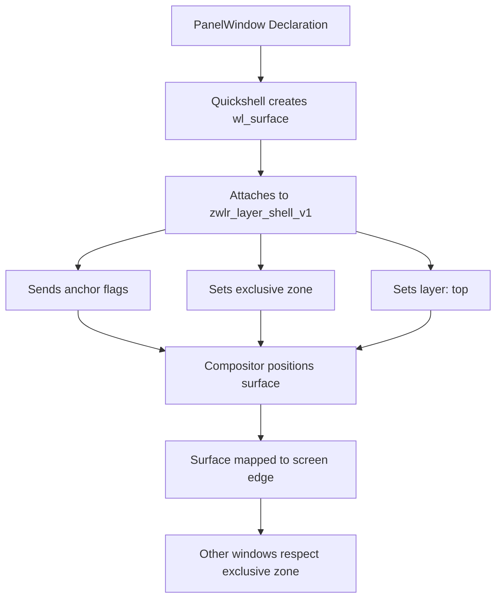

<ChapterMeta reading-time="8 min" :difficulty="2" :prerequisites="['QS Window basics', 'Anchors & Margins']" you-will-build="A simple desktop bar using PanelWindow" />

## The Problem

A desktop panel (a bar at the top or bottom of the screen) is not a regular application window. It must:

- Attach itself to the edge of the screen with no chrome or title bar.
- Reserve space so maximized windows don't overlap it.
- Stay above normal windows without stealing focus.
- Span the full width or height of the monitor.

Regular `Window` types from Qt Quick don't support these behaviors. They are managed by the window manager as ordinary toplevels.

## The Naive Approach

You could try using a `Window` with `flags: Qt.FramelessWindowHint` and manually position it at `x: 0, y: 0` with `width: Screen.width`. But this approach breaks immediately:

- The window manager still treats it as a floating window — maximized apps will cover it.
- There's no way to tell the compositor "reserve this space at the top."
- On Wayland, clients cannot set their own position. The compositor decides placement.

```qml
// This does NOT work reliably on Wayland:
Window {
  x: 0; y: 0
  width: Screen.width; height: 40
  flags: Qt.FramelessWindowHint
  // Maximized windows will cover this
}
```

<MentalModel>

Think of the screen as a whiteboard. Regular windows are sticky notes — they can be moved around but stay on top of the board. A panel is a strip of magnetic tape attached to the edge of the whiteboard frame. It's always there, it doesn't cover the writing area, and it tells other sticky notes "this part of the board is taken."

</MentalModel>

## The Idea

Quickshell provides `PanelWindow` — a window type built on the Wayland Layer Shell protocol. It understands the concept of screen edges, exclusive space, and layer ordering. A `PanelWindow` tells the compositor: "I am a panel, attach me to this edge, reserve this much space, and stay above normal windows."

```qml
import Quickshell

PanelWindow {
  anchors.top: true
  anchors.left: true
  anchors.right: true
  height: 36
  exclusiveZone: 36
}
```

This single declaration creates a bar that spans the top edge of the screen, reserves 36 pixels of space, and will not be covered by maximized windows.

## Let's Build It

Let's build a minimal top bar with a clock:

<BuildIt>

```qml
import Quickshell
import QtQuick
import QtQuick.Layouts

PanelWindow {
  id: topBar

  height: 36
  anchors {
    top: true
    left: true
    right: true
  }
  exclusiveZone: height
  aboveWindows: true
  exclusionMode: ExclusionMode.Auto

  Rectangle {
    anchors.fill: parent
    color: "#1a1b26"

    RowLayout {
      anchors {
        fill: parent
        leftMargin: 12
        rightMargin: 12
      }
      spacing: 8

      Text {
        text: ""
        font.pixelSize: 16
        color: "#c0caf5"
        Layout.alignment: Qt.AlignVCenter
      }

      Item { Layout.fillWidth: true }

      Text {
        id: clock
        text: new Date().toLocaleTimeString(Qt.locale(), "HH:mm")
        font.pixelSize: 14
        color: "#a9b1d6"
        Layout.alignment: Qt.AlignVCenter

        Timer {
          interval: 1000
          running: true
          repeat: true
          onTriggered: clock.text = new Date().toLocaleTimeString(Qt.locale(), "HH:mm")
        }
      }
    }
  }
}
```

</BuildIt>

## Let's Improve It

A static bar is a good start. Let's add a system tray area placeholder, make the background semi-transparent, and react to screen geometry changes:

```qml
PanelWindow {
  id: bar

  height: 36
  anchors {
    top: true
    left: true
    right: true
  }
  exclusiveZone: height
  exclusionMode: ExclusionMode.Normal

  Rectangle {
    anchors.fill: parent
    color: "#cc1a1b26" // semi-transparent

    RowLayout {
      anchors {
        fill: parent
        leftMargin: 12
        rightMargin: 12
      }

      Text {
        text: ""
        font.pixelSize: 18
        color: "#7aa2f7"
      }

      Text {
        text: "Quickshell"
        font.pixelSize: 12
        color: "#565f89"
        Layout.leftMargin: 4
      }

      Item { Layout.fillWidth: true }

      Row {
        spacing: 8
        Layout.alignment: Qt.AlignVCenter

        Text { text: ""; color: "#9ece6a"; font.pixelSize: 14 }
        Text { text: ""; color: "#e0af68"; font.pixelSize: 14 }
        Text { text: ""; color: "#7dcfff"; font.pixelSize: 14 }
      }

      Text {
        id: clock
        text: new Date().toLocaleTimeString(Qt.locale(), "HH:mm")
        font.pixelSize: 14
        font.bold: true
        color: "#c0caf5"
        Layout.leftMargin: 12

        Timer {
          interval: 1000
          running: true
          repeat: true
          onTriggered: clock.text = new Date().toLocaleTimeString(Qt.locale(), "HH:mm")
        }
      }
    }
  }
}
```

<CommonMistake>

**Setting anchors to `true` vs anchoring to an item.** On `PanelWindow`, the `anchors` properties (`anchors.top`, `anchors.left`, etc.) are booleans that tell the compositor which screen edge to attach to. This is different from QML's `Item.anchors` where you anchor to another item's edge. Mixing them up is a common source of confusion.

**Forgetting `exclusiveZone`.** Without an `exclusiveZone`, the compositor won't reserve space. Maximized windows will slide underneath your panel. Always set `exclusiveZone` to at least your panel's height (for horizontal bars) or width (for vertical bars).

**Setting `focusable: true`.** Panels should rarely be focusable. The default (`false`) is correct. Setting it to `true` means clicking the panel could steal focus from the active application.

</CommonMistake>

## Under the Hood

`PanelWindow` is Quickshell's QML wrapper around the Wayland Layer Shell protocol (`zwlr_layer_shell_v1`). When you create a `PanelWindow`:

1. Quickshell creates a `wl_surface` and attaches it to the layer shell.
2. The `anchors` booleans are mapped to the `zwlr_layer_surface_v1.anchor` bitfield (top, bottom, left, right).
3. The `exclusiveZone` is sent via `zwlr_layer_surface_v1.set_exclusive_zone`.
4. The compositor responds by allocating the requested space and positioning the surface.

Because this all happens at the Wayland protocol level, the behavior is consistent across all compositors that implement the Layer Shell protocol (Hyprland, Sway, River, etc.).

<UnderTheHood>

`PanelWindow` internally derives from `QsWindow`, which manages the `wl_surface` lifecycle. The layer shell requests are sent during `QQuickView::componentComplete()`. If you change `exclusiveZone` or `anchors` at runtime, Quickshell sends the updated state to the compositor, which may re-layout its surfaces.

</UnderTheHood>

<ProfessionalTip>

Use `exclusionMode: ExclusionMode.Ignore` when you want a floating overlay panel (e.g., a notification popup) that should not reserve space. Use `ExclusionMode.Auto` for normal panels that should push other windows away.

</ProfessionalTip>

## Diagram



## Exercises

<ExerciseBlock :difficulty="1">
Create a `PanelWindow` attached to the bottom edge of the screen with a height of 30 pixels and an exclusive zone of 30. Give it a dark background and a centered `Text` element.
</ExerciseBlock>

<ExerciseBlock :difficulty="2">
Add workspaces indicator to the panel: show four workspace dots (using `Row` of `Rectangle` elements). Highlight the active workspace with a different color.
</ExerciseBlock>

<ExerciseBlock :difficulty="3">
Build a vertical panel on the left edge of the screen (width: 48, anchors left: true, top: true, bottom: true). Inside, place vertically stacked icons for workspace indicators and a system tray at the bottom using `ColumnLayout` with an `Item` spacer filling the middle.
</ExerciseBlock>

<Recap :points="['PanelWindow attaches to screen edges using boolean anchors', 'exclusiveZone reserves screen space so maximized windows avoid the panel', 'aboveWindows controls whether the panel renders above or below normal windows', 'PanelWindow is backed by the Wayland Layer Shell protocol', 'Panels should rarely be focusable']" next-chapter="/part-3-windows/floating-window" />

<!--
Sources verified for this chapter:
- https://quickshell.org/docs/v0.3.0/types/Quickshell/PanelWindow/ — PanelWindow type
- https://wayland.app/protocols/wlr-layer-shell-unstable-v1 — wlr-layer-shell protocol
- https://quickshell.org/docs/v0.3.0/guide/qml-language/ — QML Language
-->
