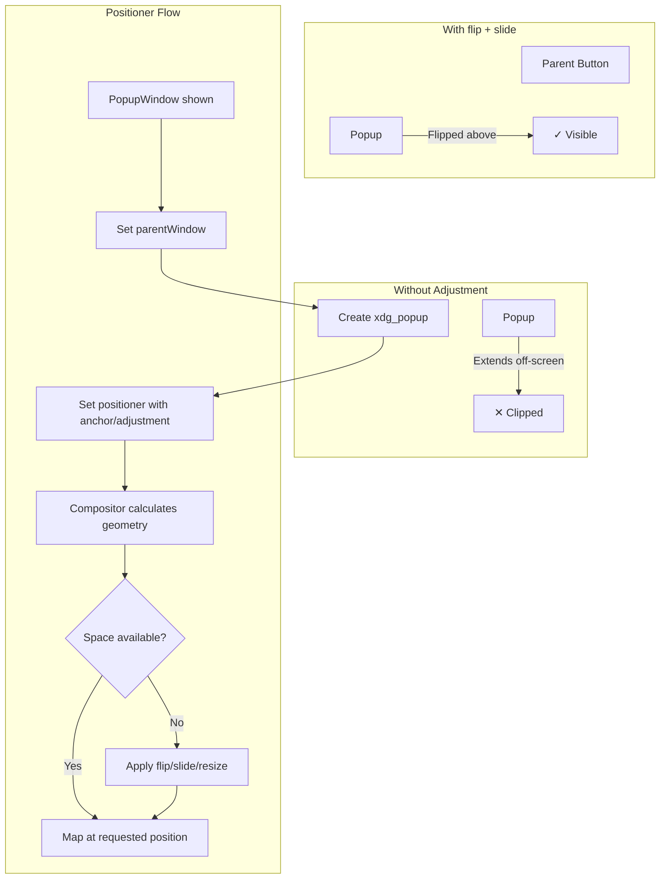

<ChapterMeta reading-time="8 min" :difficulty="3" :prerequisites="['FloatingWindow', 'Anchors & Margins']" you-will-build="A dropdown menu system using PopupWindow" />

## The Problem

Dropdown menus, tooltips, context menus, and combobox popups have unique windowing requirements that neither `PanelWindow` nor `FloatingWindow` handles well:

- They must appear at a specific position relative to a parent element (e.g., below a button).
- They should close automatically when the user clicks outside them.
- They must not appear in the taskbar or window switcher.
- They need to stay within the visible screen area (no clipping off the edge).
- On Wayland, positioning must be done via protocol requests — there is no `setGeometry()`.

## The Naive Approach

A `FloatingWindow` positioned manually:

```qml
FloatingWindow {
  x: buttonX
  y: buttonY + buttonHeight
  width: 200
  height: 300
}
```

This fails on Wayland because clients cannot set their own position. The compositor decides placement based on the `xdg_surface` configure events. You get no control over where the popup appears, and it may clip off the screen edge.

<MentalModel>

Think of popups like an extending tray table on an airplane seat. You don't place it arbitrarily in the cabin — it deploys from the seat in front of you, at a specific position relative to it. If there's not enough space (the seat is too close), it adjusts its angle. Similarly, a popup deploys from its parent and adjusts to stay within the screen.

</MentalModel>

## The Idea

Quickshell provides `PopupWindow` — a window type specifically designed for transient surfaces that follow a parent. It uses the `xdg_popup` protocol (on Wayland) to negotiate positioning with the compositor, ensuring the popup is placed relative to its parent and stays on-screen.

`PopupWindow` uses `PopupAnchor` to describe the attachment point and `PopupAdjustment` to describe how the popup should slide or flip when it doesn't fit.

```qml
import Quickshell

PopupWindow {
  parentWindow: myPanel
  anchor: PopupAnchor {
    edges: PopupEdge.TopEdge | PopupEdge.RightEdge
    offset: Qt.point(0, 4)
  }
}
```

## Let's Build It

Let's build a dropdown menu that opens below a button:

<BuildIt>

```qml
import Quickshell
import QtQuick
import QtQuick.Layouts

Item {
  id: container
  width: 200; height: 400

  Rectangle {
    id: menuButton
    anchors {
      top: parent.top
      horizontalCenter: parent.horizontalCenter
    }
    width: 140; height: 36
    radius: 6
    color: "#3b4261"

    Text {
      text: " Menu"
      anchors.centerIn: parent
      color: "#c0caf5"
      font.pixelSize: 13
    }

    MouseArea {
      anchors.fill: parent
      onClicked: popup.visible = !popup.visible
    }
  }

  PopupWindow {
    id: popup
    parentWindow: container.Window
    width: 200
    height: 200

    anchor: PopupAnchor {
      edges: PopupEdge.TopEdge | PopupEdge.LeftEdge
      offset: Qt.point(0, 4)
    }

    Rectangle {
      anchors.fill: parent
      color: "#1a1b26"
      radius: 6
      border.color: "#3b4261"
      border.width: 1

      ColumnLayout {
        anchors {
          fill: parent
          margins: 4
        }
        spacing: 2

        Repeater {
          model: ["Settings", "Profile", "Updates", "About"]

          Rectangle {
            Layout.fillWidth: true
            Layout.preferredHeight: 32
            radius: 4
            color: mouseArea.containsMouse ? "#3b4261" : "transparent"

            Text {
              text: modelData
              anchors {
                left: parent.left
                verticalCenter: parent.verticalCenter
                leftMargin: 12
              }
              color: "#c0caf5"
              font.pixelSize: 13
            }

            MouseArea {
              id: mouseArea
              anchors.fill: parent
              hoverEnabled: true
              onClicked: popup.visible = false
            }
          }
        }
      }
    }
  }
}
```

</BuildIt>

## Let's Improve It

Real popups need smarter positioning. Let's add `PopupAdjustment` to make the popup flip upward when there's no space below:

```qml
PopupWindow {
  id: smartPopup

  parentWindow: parentItem.Window
  width: 220
  height: 300

  anchor: PopupAnchor {
    edges: PopupEdge.TopEdge | PopupEdge.LeftEdge
    offset: Qt.point(0, 4)
    adjustment: PopupAdjustment {
      flip: true        // Flip to opposite edge if no space
      slide: true       // Slide along the edge if partially offscreen
      resize: true      // Resize the popup if it exceeds available space
    }
  }

  // Dismiss on click outside (handled by compositor via xdg_popup)
  onVisibleChanged: {
    if (visible) forceActiveFocus()
  }
}
```

The `flip` property tells the compositor: "If this popup doesn't fit below the anchor, flip it above." `slide` allows horizontal sliding to keep within screen bounds. `resize` lets the compositor shrink the popup vertically to fit.

For closing on outside click, the `xdg_popup` protocol handles this automatically — any click outside the popup surface dismisses it.

<CommonMistake>

**Setting `parentWindow` incorrectly.** The `parentWindow` property must reference a window that is already mapped (visible). Setting it to an unmapped window will fail silently — the popup won't appear.

**Forgetting `adjustment`.** Without `flip: true`, a popup near the bottom of the screen will extend below the visible area and get clipped. Always set `flip: true` for menus that open downward.

**Nesting popups without proper parent chain.** If you open a popup from another popup, the second popup's `parentWindow` must be the first popup, not the root panel. The compositor uses this chain for proper dismiss behavior.

</CommonMistake>

## Under the Hood

`PopupWindow` is a wrapper around the `xdg_popup` Wayland protocol. When you show a `PopupWindow`:

1. Quickshell creates an `xdg_surface` for it.
2. It sends `xdg_popup.set_position` with the anchor rect and offset.
3. The compositor responds with a `configure` event containing the popup's final geometry (adjusted for `flip`/`slide`/`resize`).
4. The client acknowledges the configure and commits the surface.
5. Any click outside the popup surface generates a `popup_done` event, and Quickshell sets `visible = false`.

The `PopupAnchor` and `PopupAdjustment` types are Quickshell-specific QML wrappers that translate into `xdg_positioner` constraints.

<UnderTheHood>

The anchor `edges` field is a bitmask of `PopupEdge` values (TopEdge, BottomEdge, LeftEdge, RightEdge). The combination determines which corner of the parent the popup attaches to. For example, `TopEdge | RightEdge` attaches the popup's bottom-left corner to the parent's top-right corner. The `offset` is an additional pixel offset applied after anchoring.

</UnderTheHood>

<ProfessionalTip>

For tooltips that follow the cursor, create a single `PopupWindow` instance and reposition it by changing its `anchor` offset before showing it. Avoid creating new `PopupWindow` instances on every mouse hover — reuse one and toggle visibility.

</ProfessionalTip>

## Diagram



## Exercises

<ExerciseBlock :difficulty="1">
Create a `PopupWindow` that opens below a text label when clicked. Give it a simple list of three items. Close the popup when the user clicks outside it.
</ExerciseBlock>

<ExerciseBlock :difficulty="2">
Add `PopupAdjustment` with `flip: true` and `slide: true` to the exercise 1 popup. Place the parent button near the bottom edge of the screen and verify the popup flips upward.
</ExerciseBlock>

<ExerciseBlock :difficulty="3">
Build a right-click context menu. Create a `Rectangle` that, on `MouseArea` right-click, opens a `PopupWindow` at the cursor position. Use a single `PopupWindow` instance that you reposition by changing `anchor.offset` to the mouse coordinates relative to the parent window.
</ExerciseBlock>

<Recap :points="['PopupWindow creates transient xdg_popup surfaces for menus and tooltips', 'Use PopupAnchor to specify attachment point and offset relative to parent', 'PopupAdjustment handles flip, slide, and resize for on-screen fitting', 'The compositor automatically dismisses popups on outside clicks', 'Nested popups must form a proper parent chain']" next-chapter="/part-3-windows/layer-shell-concepts" />

<!--
Sources verified for this chapter:
- https://quickshell.org/docs/v0.3.0/types/Quickshell/PopupWindow/ — PopupWindow type
- https://wayland.app/protocols/wlr-layer-shell-unstable-v1 — wlr-layer-shell
- https://doc.qt.io/qt-6/qtqml-syntax-objectattributes.html — QML Object Attributes
-->
