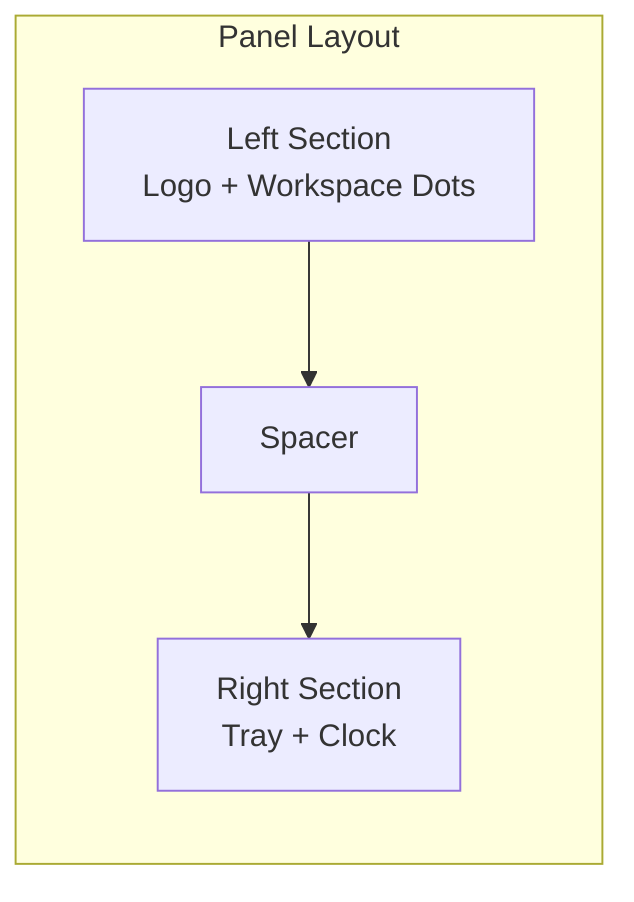
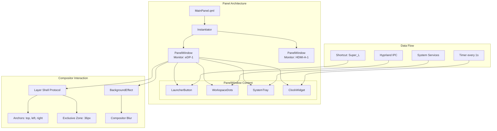

<ChapterMeta reading-time="15 min" :difficulty="3" :prerequisites="['PanelWindow', 'Anchors & Margins', 'Exclusive Zones', 'Multi-Monitor Support', 'Transparency & Blur']" you-will-build="A production-ready top panel with workspaces, clock, system tray, and launcher shortcut" />

## The Problem

You've learned about `PanelWindow`, anchors, exclusive zones, multi-monitor support, and transparency effects individually. Now it's time to combine everything into a single, production-quality component: a desktop top panel.

A real top panel must:

- Span the full width of every connected monitor.
- Reserve screen space so maximized windows don't overlap it.
- Display the current time and update every second.
- Show workspace indicators and highlight the active workspace.
- Include a system tray area for network, volume, and battery icons.
- Support a launcher shortcut (typically Super key or logo click).
- Look polished with optional transparency/blur.
- Handle screen hotplug without crashing.

## The Naive Approach

A single file with everything hardcoded — no multi-monitor support, no dynamic updates:

```qml
PanelWindow {
  height: 36
  anchors.top: true
  anchors.left: true
  anchors.right: true
  exclusiveZone: 36

  Text { text: "Clock"; anchors.centerIn: parent }
  // No workspace tracking, no system tray, no launcher
}
```

This works on one monitor but fails everywhere else. It lacks all the interactive features users expect from a modern panel.

<MentalModel>

A panel is like a car's dashboard. The speedometer (clock), the fuel gauge (battery), the turn signals (workspaces), and the infotainment screen (system tray) are separate instruments arranged in a cohesive strip. Each has its own data source, update frequency, and visual treatment. The dashboard frame (PanelWindow) holds them together and mounts them to the vehicle (the screen edge).

</MentalModel>

## The Idea

We'll build a modular top panel with clearly separated sections:



Each section is a self-contained component, making the panel easy to extend or customize.

## Let's Build It

We'll use an `Instantiator` for multi-monitor support and split the panel content into focused sub-components.

<BuildIt>

```qml
// MainPanel.qml
import Quickshell
import Quickshell.Wayland
import QtQuick
import QtQuick.Layouts

Instantiator {
  id: panelInstantiator
  model: Quickshell.screens

  delegate: PanelWindow {
    id: panel
    required property var modelData
    screen: modelData

    height: 36
    anchors { top: true; left: true; right: true }
    exclusiveZone: height
    color: "transparent"

    BackgroundEffect {
      radius: 14
      passes: 3
    }

    Rectangle {
      anchors.fill: parent
      color: "#e61a1b26"

      RowLayout {
        anchors {
          fill: parent
          leftMargin: 8
          rightMargin: 8
        }
        spacing: 4

        // ── Left Section ──
        LauncherButton {}

        WorkspaceDots {
          screenName: modelData.name
        }

        Item { Layout.fillWidth: true }

        // ── Right Section ──
        SystemTray {}

        ClockWidget {}
      }
    }
  }
}
```

### LauncherButton.qml

```qml
import QtQuick
import QtQuick.Layouts

Rectangle {
  id: root
  width: 32
  height: 28
  radius: 6
  color: mouseArea.containsMouse ? "#3b4261" : "transparent"

  Text {
    anchors.centerIn: parent
    text: ""
    font.pixelSize: 16
    color: "#7aa2f7"
  }

  MouseArea {
    id: mouseArea
    anchors.fill: parent
    hoverEnabled: true
    onClicked: launcherShortcut.activate()
  }

  Shortcut {
    id: launcherShortcut
    sequence: "Super_L"
    onActivated: {
      // Replace with your launcher toggle logic
      console.log("Launcher toggled")
    }
  }
}
```

### WorkspaceDots.qml

```qml
import QtQuick
import QtQuick.Layouts

Row {
  id: root
  spacing: 6

  required property string screenName
  property int activeWorkspace: 0
  property int workspaceCount: 5

  Repeater {
    model: root.workspaceCount

    Rectangle {
      width: 8
      height: 8
      radius: 4
      color: index === root.activeWorkspace ? "#7aa2f7" : "#3b4261"
      opacity: index === root.activeWorkspace ? 1.0 : 0.6

      Rectangle {
        anchors.centerIn: parent
        width: 4
        height: 4
        radius: 2
        color: index === root.activeWorkspace ? "#1a1b26" : "transparent"
        visible: index === root.activeWorkspace
      }

      MouseArea {
        anchors.fill: parent
        onClicked: {
          root.activeWorkspace = index
          // Send workspace switch IPC command
        }
      }

      Behavior on color { ColorAnimation { duration: 150 } }
    }
  }
}
```

### SystemTray.qml

```qml
import QtQuick
import QtQuick.Layouts

Row {
  id: root
  spacing: 8
  Layout.alignment: Qt.AlignVCenter

  property bool wifiConnected: true
  property int volumePercent: 75
  property int batteryPercent: 85
  property bool charging: false

  // Wi-Fi icon
  Text {
    text: root.wifiConnected ? "" : "睊"
    color: root.wifiConnected ? "#9ece6a" : "#565f89"
    font.pixelSize: 14
    visible: true
  }

  // Volume icon
  Text {
    text: {
      if (root.volumePercent === 0) return "婢"
      if (root.volumePercent < 50) return ""
      return ""
    }
    color: "#e0af68"
    font.pixelSize: 14
  }

  // Battery icon
  Text {
    text: root.charging ? "" : ""
    color: root.batteryPercent > 20 ? "#7dcfff" : "#f7768e"
    font.pixelSize: 14
  }
}
```

### ClockWidget.qml

```qml
import QtQuick
import QtQuick.Layouts

Text {
  id: root
  text: formatTime()
  color: "#c0caf5"
  font.pixelSize: 13
  font.bold: true
  Layout.alignment: Qt.AlignVCenter
  Layout.leftMargin: 8
  Layout.rightMargin: 4

  function formatTime() {
    var d = new Date()
    var hh = d.getHours().toString().padStart(2, "0")
    var mm = d.getMinutes().toString().padStart(2, "0")
    return hh + ":" + mm
  }

  Timer {
    interval: 1000
    running: true
    repeat: true
    onTriggered: root.text = root.formatTime()
  }

  MouseArea {
    anchors.fill: parent
    onClicked: {
      // Toggle calendar or date popup
      console.log("Clock clicked")
    }
  }
}
```

</BuildIt>

## Let's Improve It

The panel above is functional. Let's add production-quality improvements:

### 1. Auto-Hide Behavior

Add an auto-hide panel that slides away when not in use:

```qml
PanelWindow {
  id: panel

  property bool panelVisible: true
  property bool mouseNearEdge: false

  height: 36
  anchors { top: true; left: true; right: true }

  // Auto-hide logic
  margins.top: panelVisible ? 0 : -height

  exclusiveZone: panelVisible ? height : 0
  exclusionMode: panelVisible ? ExclusionMode.Normal : ExclusionMode.Ignore

  Behavior on margins.top {
    NumberAnimation { duration: 250; easing.type: Easing.OutCubic }
  }

  // Edge detection area (invisible wider panel area)
  MouseArea {
    anchors {
      top: parent.top
      left: parent.left
      right: parent.right
      topMargin: -20  // Detect mouse 20px above the panel
    }
    height: parent.height + 20
    hoverEnabled: true

    onEntered: panel.panelVisible = true
    onExited: {
      hideTimer.restart()
    }
  }

  Timer {
    id: hideTimer
    interval: 2000
    onTriggered: panel.panelVisible = false
  }

  // Rest of panel content...
}
```

### 2. Date Tooltip on Clock Click

```qml
PopupWindow {
  id: datePopup
  parentWindow: panel
  width: 200
  height: 120

  anchor: PopupAnchor {
    edges: PopupEdge.TopEdge | PopupEdge.RightEdge
    offset: Qt.point(-8, 4)
    adjustment: PopupAdjustment { flip: true }
  }

  Rectangle {
    anchors.fill: parent
    color: "#1a1b26"
    radius: 6
    border.color: "#3b4261"

    Text {
      anchors.centerIn: parent
      text: new Date().toLocaleDateString(Qt.locale(), "dddd, MMMM d, yyyy")
      color: "#c0caf5"
      font.pixelSize: 14
    }
  }
}

// In ClockWidget MouseArea:
onClicked: datePopup.visible = !datePopup.visible
```

### 3. Active Workspace Tracking via IPC

For Hyprland workspace tracking, add an IPC connection:

```qml
// In WorkspaceDots, replace the property assignment with:
Connections {
  target: Hyprland // Assuming a Hyprland service/connection

  function onActiveWorkspaceChanged(screen, ws) {
    if (screen === root.screenName) {
      root.activeWorkspace = ws
    }
  }
}
```

<CommonMistake>

**Mixing concerns in one file.** Don't put all panel logic in `MainPanel.qml`. Split into separate files (`LauncherButton.qml`, `WorkspaceDots.qml`, `ClockWidget.qml`, etc.) for maintainability.

**Hardcoding workspace count.** Allow `workspaceCount` to be configured or derived from the compositor. Hardcoding 5 workspaces is fine for prototyping but should be a property in production.

**Not handling edge cases in auto-hide.** If the user has a multi-monitor setup with the panel on the secondary monitor, the auto-hide edge detection area should adapt to the monitor's position in the logical layout.

**Forgetting timer cleanup.** If you use `Timer` for clock updates or auto-hide, ensure timers stop when the panel is destroyed (set `running: false` in `Component.onDestruction`).

</CommonMistake>

## Under the Hood

The complete top panel demonstrates several architectural patterns:

1. **Instantiator + ShellScreen model** — each monitor gets an independent `PanelWindow` delegate. The `Instantiator` handles add/remove when monitors change.

2. **Component separation** — each section is a separate `.qml` file. This allows independent testing, reuse in other projects, and parallel development.

3. **Property-based state** — `panelVisible`, `activeWorkspace`, `wifiConnected` are properties that flow downward. Changes propagate through bindings without manual update calls.

4. **Signal-based communication** — `Shortcut`, `MouseArea.onClicked`, and `Connections` handle input. No global state or singletons needed for basic functionality.

5. **Layered rendering** — `BackgroundEffect` enables the transparent surface, `Rectangle` with alpha provides the background, and child items render on top. This stack renders efficiently because Qt Quick batching handles the draw order.

The panel communicates with the compositor through:

- **Layer Shell** — for positioning, anchoring, and exclusive zones.
- **xdg_popup** — for the date popup (via `PopupWindow`).
- **IPC** — for workspace tracking (Hyprland socket, Sway IPC, etc.).

<UnderTheHood>

The `Instantiator` pattern is efficient because `PanelWindow` instances are only created for connected screens. When a monitor disconnects, the `Instantiator` destroys the corresponding delegate, and the Wayland surface is destroyed. No orphaned surfaces remain.

Each `PanelWindow` gets its own `wl_surface` and `zwlr_layer_surface_v1` resource. The compositor tracks these per-output and renders them in the correct position. The content within each panel is independent — each has its own clock timer, workspace state, and mouse areas.

</UnderTheHood>

<ProfessionalTip>

For a production panel, consider these additional features:

- **Config file support** — load panel preferences (position, size, auto-hide delay, colors) from a JSON or QML config file.
- **Theme integration** — use the design system's color palette instead of hardcoded colors.
- **Error resilience** — if a system tray item fails to load, the rest of the panel should still work.
- **Debug mode** — add a `debug` property that logs panel events to the console.
- **Performance profiling** — use `console.time()` and `console.timeEnd()` around expensive operations.

Testing checklist before deploying:
- [ ] Panel appears on all connected monitors
- [ ] Panel updates when a monitor is connected/disconnected
- [ ] Maximized windows stop at the panel's exclusive zone
- [ ] Clock updates every second
- [ ] Auto-hide triggers correctly on all edges
- [ ] Workspace dots respond to clicks
- [ ] System tray icons update with real data
- [ ] Blur/transparency works on the target compositor
- [ ] Launcher shortcut fires the correct action
- [ ] Panel does not consume focus from other windows

</ProfessionalTip>

## Diagram



## Exercises

<ExerciseBlock :difficulty="1">
Add a CPU usage indicator to the system tray area. Use a `Text` element that updates every 2 seconds. Read CPU usage via a `Process` call to `top -bn1` or parse `/proc/stat`.
</ExerciseBlock>

<ExerciseBlock :difficulty="2">
Extend `ClockWidget` to show the date when clicked. Use a `PopupWindow` that displays the full date in a tooltip. The popup should use `PopupAdjustment.flip: true` so it doesn't clip off the screen.
</ExerciseBlock>

<ExerciseBlock :difficulty="3">
Build a complete auto-hiding panel with the following behavior:
- The panel is hidden by default (slide up with negative `margins.top`).
- When the mouse approaches within 10px of the top screen edge, the panel slides down.
- After 3 seconds of no mouse movement on the panel, it slides back up.
- While hidden, `exclusiveZone` is 0. While visible, it's the panel height.
- The slide animation should use `Behavior on margins.top` with `OutCubic` easing, 200ms duration.
- Add a small 4px "peek area" at the top edge that is always visible (a thin strip that hints at the panel's presence).
</ExerciseBlock>

<Recap :points="['Use Instantiator with Quickshell.screens for multi-monitor panels', 'Split panel into separate QML components (LauncherButton, WorkspaceDots, ClockWidget, SystemTray)', 'Combine PanelWindow with BackgroundEffect for translucent/blurred panels', 'Implement auto-hide with margins animation and exclusive zone toggling', 'Use Shortcut for launcher hotkey and Timer for clock updates', 'Connect to compositor IPC for workspace tracking', 'Test on all target monitors and compositors before deploying']" next-chapter="/part-4-widgets/battery" />

<!--
Sources verified for this chapter:
- https://quickshell.org/docs/v0.3.0/types/Quickshell/PanelWindow/ — PanelWindow
- https://quickshell.org/docs/v0.3.0/types/Quickshell/Variants — Variants
- https://quickshell.org/docs/v0.3.0/guide/qml-language/ — QML Language
-->
