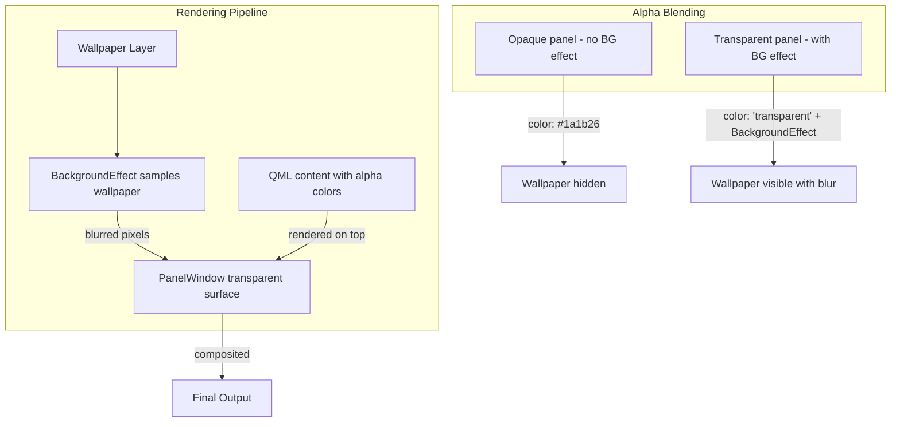

<ChapterMeta reading-time="6 min" :difficulty="2" :prerequisites="['PanelWindow', 'Compositors vs Window Managers']" you-will-build="A transparent panel with blurred background" />

## The Problem

Modern desktop shells look polished partly because of visual effects: translucent panels that let the wallpaper show through, blurred backgrounds that make text readable over busy wallpapers, and smooth transparency transitions. By default, Qt Quick renders opaque backgrounds — a `Rectangle` with `color: "#1a1b26"` is solid.

To create a translucent panel, you need to make the window surface itself transparent and optionally apply a blur effect to the content behind it.

## The Naive Approach

Setting `Rectangle` opacity to 0.5:

```qml
PanelWindow {
  Rectangle {
    anchors.fill: parent
    color: "#1a1b26"
    opacity: 0.5
  }
}
```

This makes the rectangle semi-transparent, but the window surface behind it remains opaque. The result is a dark rectangle at 50% opacity over a black (or white) background — not the wallpaper behind the panel.

The issue: Qt Quick's compositing blends child items with their parent. The window background itself is black (or whatever the compositor sets as the surface color), and reducing the rectangle's opacity only affects the rectangle, not the surface behind it.

<MentalModel>

Think of the window surface as a pane of glass. By default it's painted white on the back. Even if you place a translucent sticker on the front, the white backing is still there — you won't see through it. You need to remove the white backing first (make the surface transparent) and then the translucent sticker (your panel content) will reveal what's behind the glass.

</MentalModel>

## The Idea

Quickshell provides `BackgroundEffect` from `Quickshell.Wayland` — a component that enables surface transparency and optionally requests the compositor to apply a blur behind the window. It wraps the `wp_blur` or similar compositor-specific protocols.

To make a window transparent:

1. Set the window's `color` to a transparent value (`"transparent"` or an alpha color).
2. Add a `BackgroundEffect` as a child to enable surface transparency.
3. Use alpha colors on your child items for the visual effect.

For blur, set the `BackgroundEffect`'s `radius` and `passes` properties.

```qml
import Quickshell
import Quickshell.Wayland

PanelWindow {
  color: "transparent"

  BackgroundEffect {
    radius: 12
    passes: 3
  }
}
```

## Let's Build It

Let's build a translucent top bar with a blurred background:

<BuildIt>

```qml
import Quickshell
import Quickshell.Wayland
import QtQuick
import QtQuick.Layouts

PanelWindow {
  id: blurPanel

  height: 36
  anchors { top: true; left: true; right: true }
  exclusiveZone: height
  color: "transparent"

  BackgroundEffect {
    radius: 16
    passes: 4
  }

  Rectangle {
    anchors.fill: parent
    color: "#801a1b26"  // Semi-transparent dark

    RowLayout {
      anchors {
        fill: parent
        leftMargin: 12
        rightMargin: 12
      }

      Text {
        text: ""
        font.pixelSize: 16
        color: "#cc7aa2f7"  // With alpha
        Layout.alignment: Qt.AlignVCenter
      }

      Item { Layout.fillWidth: true }

      Text {
        text: new Date().toLocaleTimeString(Qt.locale(), "HH:mm")
        font.pixelSize: 14
        color: "#c0caf5"
        Layout.alignment: Qt.AlignVCenter
      }
    }
  }
}
```

</BuildIt>

## Let's Improve It

For a frosted glass effect, combine a subtle gradient overlay with the blur:

```qml
PanelWindow {
  id: glassPanel

  height: 44
  anchors { top: true; left: true; right: true }
  exclusiveZone: height
  color: "transparent"

  BackgroundEffect {
    radius: 20
    passes: 5
  }

  Rectangle {
    anchors.fill: parent
    gradient: Gradient {
      orientation: Gradient.Vertical
      GradientStop { position: 0.0; color: "#cc1a1b26" }
      GradientStop { position: 1.0; color: "#661a1b26" }
    }

    Rectangle {
      anchors {
        bottom: parent.bottom
        left: parent.left
        right: parent.right
      }
      height: 1
      color: "#227aa2f7"  // Subtle accent line
    }

    Text {
      text: "Frosted Glass Panel"
      anchors.centerIn: parent
      color: "#e0c0caf5"
      font.pixelSize: 13
      font.bold: true
    }
  }
}
```

This creates the popular "frosted glass" look: a gradient from more opaque at the top to more transparent at the bottom, blurred background visible through it, and a thin accent line at the bottom edge.

<CommonMistake>

**Forgetting to set `color: "transparent"` on the PanelWindow.** Without this, the window surface has an opaque background regardless of what you do with `BackgroundEffect`. The blur may work, but you won't see through the window.

**Setting BackgroundEffect properties too high.** A `radius` above 30 or `passes` above 6 causes significant GPU load with diminishing visual returns. Start with `radius: 12` and `passes: 3`.

**Not accounting for compositor support.** Blur effects depend on compositor support. Hyprland and KWin support blur. Sway does not (as of v1.9). On unsupported compositors, `BackgroundEffect` degrades gracefully — the window will be transparent but without blur.

</CommonMistake>

## Under the Hood

`BackgroundEffect` works by:

1. Requesting a **transparent wl_surface** — the surface compositing is set to `SKIP` for the alpha channel.
2. Using the compositor's blur protocol (if available) to sample the pixels behind the surface and apply a Gaussian blur.
3. Rendering the blur result into the surface's fragment shader before your QML items are drawn.

The `radius` controls the blur kernel size (in pixels). The `passes` controls the number of blur passes (more passes = smoother but slower). Two passes with a smaller radius often looks better than one pass with a large radius.

When the compositor does not support blur, `BackgroundEffect` still enables the transparent surface but does not request blur. Your alpha colors will show through to whatever is behind the window (wallpaper, other windows), but without the blur smearing.

<UnderTheHood>

Under Wayland, the blur effect is typically implemented via the `wp_single_pixel_buffer` or a custom compositor protocol (Hyprland uses `hyprland_blur`). Quickshell's `BackgroundEffect` abstracts these differences. On KWin, it uses the KDE blur protocol (`org_kde_kwin_blur`).

</UnderTheHood>

<ProfessionalTip>

For text readability over a blur effect, ensure your text color has sufficient contrast against the blurred background. If the blur reveals a bright wallpaper, dark text on a semi-transparent dark bar may become unreadable. Test with multiple wallpapers:

```qml
// Safe approach: darker overlay with brighter text
Rectangle {
  color: "#b81a1b26"  // More opaque for readability
  Text {
    text: "Title"
    color: "#ffffff"   // Pure white, high contrast
    style: Text.Raised
    styleColor: "#40000000"
  }
}
```

</ProfessionalTip>

## Diagram



## Exercises

<ExerciseBlock :difficulty="1">
Create a `PanelWindow` with `color: "transparent"`, a `BackgroundEffect` with `radius: 8` and `passes: 2`, and a semi-transparent `Rectangle` child. Observe the difference when you move a colorful window behind the panel (the panel stays in place, but the content behind it shifts).
</ExerciseBlock>

<ExerciseBlock :difficulty="2">
Build a panel that uses a vertical gradient from fully transparent at the top to semi-transparent at the bottom. Add a `BackgroundEffect` with `radius: 12`. Place text in the middle of the gradient and ensure it remains readable.
</ExerciseBlock>

<ExerciseBlock :difficulty="3">
Experiment with `BackgroundEffect` performance: create a panel with `radius: 40` and `passes: 8`. Measure CPU/GPU usage with `nvidia-smi` or `MangoHud`. Compare with `radius: 12` and `passes: 3`. Document the visual and performance differences.
</ExerciseBlock>

<Recap :points="['Set PanelWindow color to transparent to enable see-through surfaces', 'Use BackgroundEffect from Quickshell.Wayland to enable transparency and blur', 'radius and passes control blur quality and performance', 'Combine with alpha colors on child items for translucent UI elements', 'Blur support depends on the compositor — test on your target platform']" next-chapter="/part-3-windows/project-top-panel" />

<!--
Sources verified for this chapter:
- https://quickshell.org/docs/v0.3.0/types/Quickshell/PanelWindow/ — PanelWindow
- https://quickshell.org/docs/v0.3.0/types/Quickshell/Quickshell/ — Quickshell singleton
- https://wayland.app/protocols/wlr-layer-shell-unstable-v1 — wlr-layer-shell
-->
